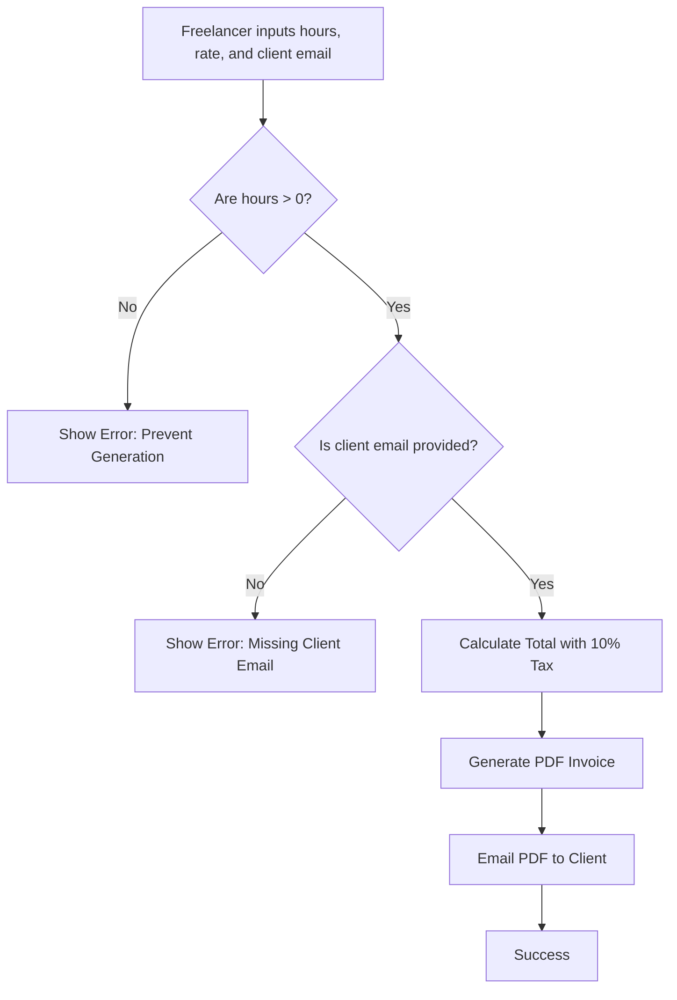

# Auto-Invoice Generator
**ID**: SPEC-INV-001
**Version**: 1.0
**Status**: Draft
**Type**: Functional Specification

## Overview & Purpose
The Auto-Invoice Generator is a system designed to automate the creation and delivery of PDF invoices based on timesheet data. 

## Goals
* Automate the creation of PDF invoices from timesheet data.
* Achieve a 50% reduction in manual invoicing time.

## Target Users
* **Freelancers**: Users who input timesheet data to create invoices.
* **Clients**: Recipients of the generated PDF invoices.

## Stakeholders
None specified.

## Scope
**In Scope**:
* PDF document generation.
* Email delivery of invoices.
* Basic tax calculation (flat rate).

**Out of Scope**:
* Payment processing.
* Multi-currency support.

## MoSCoW
None specified.

## Functional Requirements
* **FR1: Timesheet Data Input**
  The system shall allow a freelancer to input hours worked and their hourly rate.
  * *Acceptance Criteria*: Given the user is on the input interface, When they enter numeric values for hours and rate, Then the system stores these values for calculation.
* **FR2: Tax and Total Calculation**
  The system shall calculate the total amount, adding a flat 10% tax to the subtotal.
  * *Acceptance Criteria*: Given the user has provided hours and an hourly rate, When the system processes the data, Then it multiplies hours by the rate and adds exactly 10% to calculate the final total.
* **FR3: PDF Generation**
  The system shall generate a PDF invoice containing the calculated data.
  * *Acceptance Criteria*: Given a successfully calculated total, When the generation process is triggered, Then the system creates a formatted PDF file.
* **FR4: Email Delivery**
  The system shall email the generated PDF to the client's email address.
  * *Acceptance Criteria*: Given a generated PDF and a provided client email, When the delivery step is reached, Then the system sends an email with the PDF attached to the specified address.

## User Stories
* **US1**: As a Freelancer, I want to input my hours worked and hourly rate, so that the system can calculate my invoice amount.
  * *Given* I am creating a new invoice, *When* I enter valid hours and a valid hourly rate, *Then* the system accepts the input for processing.
  * *Given* I am creating a new invoice, *When* I enter zero hours, *Then* the system prevents generation and displays an error.
* **US2**: As a Freelancer, I want the system to automatically add a 10% flat tax to my total, so that my invoice is accurate and compliant.
  * *Given* I have entered my hours and rate, *When* the system calculates the total, *Then* it adds exactly 10% to the base amount.
* **US3**: As a Freelancer, I want to generate a PDF version of the invoice, so that I have a professional document to send to my client.
  * *Given* the invoice data is complete and valid, *When* the generation is triggered, *Then* a PDF file is created and saved/presented.
* **US4**: As a Freelancer, I want the system to email the PDF directly to the client, so that I save time on manual communication.
  * *Given* the PDF is generated and the client email is provided, *When* the system processes the delivery, *Then* the client receives an email with the PDF attached.
  * *Given* the client email is missing, *When* the system attempts delivery, *Then* it displays an error and halts the process.

## Inputs/Outputs/Data Flow
**Inputs**:
* Hours worked (Numeric)
* Hourly rate (Numeric)
* Client email address (String/Email format)

**Outputs**:
* Calculated total amount (Numeric)
* Generated Invoice (PDF File)
* Delivered Message (Email transmission)

**Data Flow**:
1. Freelancer inputs hours, rate, and client email.
2. System calculates the subtotal (hours × rate) and the final total (subtotal + 10% tax).
3. System compiles the input and calculated data into a PDF document.
4. System dispatches an email to the client containing the PDF attachment.

## Flows

## Edge Cases & Error States
* **Zero Hours Logged**: If the user inputs 0 for hours worked, the system must prevent invoice generation and display an error state.
* **Missing Client Email**: If the client email field is empty or invalid, the system must halt the email delivery process and display an error state.

## Acceptance Criteria (Given/When/Then)
* **Happy Path**: 
  * *Given* valid hours (>0), a valid hourly rate, and a valid client email, *When* the user submits the form, *Then* the system calculates the total with 10% tax, generates a PDF, and emails it to the client successfully.
* **Failure Path 1 (Zero Hours)**: 
  * *Given* the user enters 0 for hours worked, *When* they attempt to generate the invoice, *Then* the system blocks the action and displays a "zero hours logged" error.
* **Failure Path 2 (Missing Email)**: 
  * *Given* the user leaves the client email blank, *When* they attempt to generate or send the invoice, *Then* the system blocks the action and displays a "missing client email" error.

## Non-Functional Requirements
* **Performance**: 95% of invoices must be generated within 5 seconds.

## Assumptions
* The system operates in a single default currency, as multi-currency support is explicitly out of scope.
* The tax rate is strictly fixed at 10% and does not require dynamic adjustment by the user.

## Dependencies
None specified.

## Open Questions
* Who are the specific business stakeholders for this project?
* What is the default currency to be used for the invoices?
* What email service or sender address should be used to dispatch the invoices?
* Are there specific formatting, layout, or branding requirements for the PDF invoice template?
* Is there a maximum limit for hours worked or hourly rate inputs?

## Success Metrics
* 95% of invoices generated within 5 seconds.
* 50% reduction in manual invoicing time.