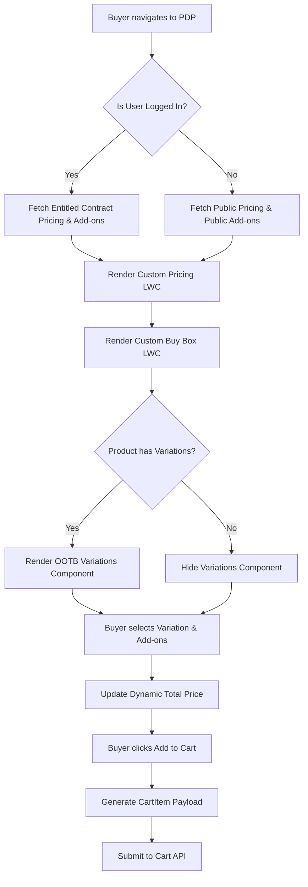

# B2B Commerce Amazon-Style Product Detail Page (PDP)

**ID:** SPEC-PDP-001  
**Version:** 1.0  
**Status:** Draft  
**Type:** Functional Specification  

## Overview & Purpose
The business requires a highly customized Product Detail Page (PDP) for the Amazon Business B2B Commerce Cloud storefront. The purpose of this initiative is to replicate an Amazon-style layout featuring a vertical image gallery, detailed pricing breakdowns, promotional offers, product variations, and a complex buy box with add-on services. This will be achieved by cloning the default PDP in Experience Builder to create a new page variation, utilizing a mix of out-of-the-box (OOTB) Salesforce B2B Commerce components and custom Lightning Web Components (LWCs). The implementation must strictly adhere to the US multi-currency (USD) configuration.

## Goals
*   **OBJ-01:** Map all visual components from the provided PDP design to Salesforce B2B Commerce data models (100% of design elements categorized as OOTB or custom LWC).
*   **OBJ-02:** Ensure the new PDP layout supports standard B2B buyer entitlements and contract pricing (Zero regressions in the add-to-cart and checkout flows for entitled buyers).

## Target Users
*   **B2B Buyer:** End-users navigating the storefront to evaluate products, view contract pricing, configure variations/add-ons, and add items to the cart.
*   **Storefront Administrator:** System users responsible for managing the page layout and component architecture via Experience Builder.

## Stakeholders
*   **B2B Buyer**
    *   *Decision authority:* None
    *   *Concerns:* Ability to easily view product details, variations, and contract pricing; ability to add protection plans and bulk quantities to the cart.
*   **Storefront Administrator**
    *   *Decision authority:* Approves page layout and component architecture.
    *   *Concerns:* Ability to manage the page layout using Experience Builder; maintainability of custom components.

## Scope
**In Scope:**
*   Creation of a cloned PDP variation in Experience Builder.
*   Mapping and implementation of OOTB components (Breadcrumbs, Product Variations).
*   Development of custom LWCs (Image Gallery, Pricing, Buy Box, Promotional Offers/Trust Badges).
*   Integration with standard Salesforce B2B Commerce data models (Product2, ProductMedia, PricebookEntry, CartItem, etc.).
*   Strict enforcement of US multi-currency (USD) formatting.

**Out of Scope:**
*   Writing or generating any Apex, LWC JavaScript, or HTML code during the analysis phase.
*   Implementing INR currency or GST tax calculations (despite mockup visuals).
*   Modifying standard Salesforce managed-package components directly.

## MoSCoW
None specified. 

## Functional Requirements

*   **FR-01: Experience Builder Page Variation**
    *   The system shall support a cloned Experience Builder page variation for the PDP to host the new layout.
    *   *Acceptance Criteria:* 
        *   **Given** the administrator is in Experience Builder, **When** they select the Product Detail page and choose to create a new page variation, **Then** a new page layout is created without overwriting the default fallback page.
*   **FR-02: Breadcrumbs Component**
    *   The system shall use the OOTB Breadcrumbs component mapped to the ProductCategory object.
    *   *Acceptance Criteria:* 
        *   **Given** a user navigates to a product, **When** the PDP loads, **Then** the OOTB breadcrumbs render the correct category hierarchy sourced from the ProductCategory object.
*   **FR-03: Custom Image Gallery LWC**
    *   The system shall require a custom LWC for the Image Gallery to support a vertical thumbnail layout, sourcing data from the ProductMedia object.
    *   *Acceptance Criteria:* 
        *   **Given** a product has associated images, **When** the PDP loads, **Then** the custom Image Gallery displays a vertical list of thumbnails and a primary image sourced from ProductMedia.
        *   **Given** a product lacks primary or gallery images, **When** the PDP loads, **Then** the component displays a standard, localized placeholder image.
*   **FR-04: Custom Pricing LWC**
    *   The system shall require a custom Pricing LWC to display MSRP, Contract Price, and Savings, sourcing data from PricebookEntry and WebStorePricebook via Connect API.
    *   *Acceptance Criteria:* 
        *   **Given** an entitled buyer views a product, **When** the pricing component renders, **Then** it displays the MSRP, the buyer's specific contract price, and calculated savings in USD format.
*   **FR-05: Product Variations Component**
    *   The system shall use the OOTB Product Variations component, sourcing data from ProductAttribute and ProductAttributeSet objects.
    *   *Acceptance Criteria:* 
        *   **Given** a product has defined variations, **When** the PDP loads, **Then** the OOTB variation selectors are displayed.
        *   **Given** a product has no defined variations or attribute sets, **When** the PDP loads, **Then** the variation selector component hides itself gracefully without leaving empty whitespace.
*   **FR-06: Custom Buy Box LWC**
    *   The system shall require a custom Buy Box LWC to consolidate standard Add to Cart functionality with custom Add-on/Protection Plan selections, writing to the CartItem object.
    *   *Acceptance Criteria:* 
        *   **Given** a buyer selects a product variation and optional add-on services, **When** they click "Add to Cart", **Then** the system prepares and submits a CartItem payload containing both the base product and the selected add-ons.
        *   **Given** a logged-out user views a product with buyer-group specific add-ons, **When** the Buy Box renders, **Then** it only displays publicly entitled add-ons and hides contract-specific services.
*   **FR-07: Promotional Offers and Trust Badges LWC**
    *   The system shall require a custom LWC for Promotional Offers and Trust Badges, sourcing data from the Promotion object and custom fields on the Product2 object.
    *   *Acceptance Criteria:* 
        *   **Given** a product has active promotions or trust badges, **When** the PDP loads, **Then** the custom LWC displays these elements sourced from the Promotion and Product2 objects.

## User Stories

*   **US-01:** As a Storefront Administrator, I want to clone the standard Product Detail Page in Experience Builder, so that I can construct the new Amazon-style layout without destroying the default fallback page.
    *   *Acceptance Criteria:* GIVEN the administrator is in Experience Builder WHEN they select the Product Detail page and choose to create a new page variation THEN a new page layout is created that can be customized with OOTB and custom components.
*   **US-02:** As a B2B Buyer, I want to view the product image gallery, title, and specifications, so that I can evaluate the product visually and technically.
    *   *Acceptance Criteria:* GIVEN a buyer navigates to the PDP WHEN the page loads THEN the system displays the product images, name, and specifications sourced from the ProductMedia and Product2 objects.
*   **US-03:** As a B2B Buyer, I want to view my specific contract pricing alongside the MSRP, so that I understand the savings provided by my B2B account.
    *   *Acceptance Criteria:* GIVEN an entitled buyer is viewing a product WHEN the pricing component renders THEN it displays the MSRP and the buyer's specific price sourced from the applicable PricebookEntry.
*   **US-04:** As a B2B Buyer, I want to select product variations and add-on services from the buy box, so that I can configure my purchase exactly as needed before adding to cart.
    *   *Acceptance Criteria:* GIVEN a product has variations (e.g., RAM/SSD) and related add-on services WHEN the buyer interacts with the variation selectors and add-on checkboxes THEN the system updates the total price and prepares the CartItem payload accordingly.

## Inputs/Outputs/Data Flow
*   **Inputs (Read):**
    *   `Product2`: Product title, specifications, custom fields for trust badges.
    *   `ProductMedia`: Primary images and gallery thumbnails.
    *   `ProductCategory`: Breadcrumb hierarchy.
    *   `PricebookEntry` & `WebStorePricebook`: MSRP and buyer-specific contract pricing (via Connect API).
    *   `ProductAttribute` & `ProductAttributeSet`: Product variation definitions.
    *   `Promotion`: Promotional offers.
*   **Outputs (Write):**
    *   `CartItem`: Payload generated by the Buy Box containing the selected base product, variations, quantities, and add-on services.

## Flows

## Edge Cases & Error States
*   **EC-01 (Missing Variations):** A product has no defined variations or attribute sets. 
    *   *Handling:* The variation selector component must hide itself gracefully without leaving empty whitespace.
*   **EC-02 (Missing Images):** A product lacks primary or gallery images in the ProductMedia object. 
    *   *Handling:* The image gallery component must display a standard, localized placeholder image.
*   **EC-03 (Authentication/Entitlement mismatch):** A logged-out user views a product with buyer-group specific add-ons. 
    *   *Handling:* The buy box must only display publicly entitled add-ons and hide contract-specific services.

## Acceptance Criteria
*(Acceptance criteria are documented inline within the Functional Requirements and User Stories sections above to ensure strict adherence to BA rules.)*

## Non-Functional Requirements
*   **NFR-01 (Usability / Localization):** The custom PDP layout must accommodate text expansion for multi-language support. Layouts must tolerate approximately 30% text expansion without breaking the grid.
*   **NFR-02 (Accessibility):** Dynamic pricing and buy box updates must be announced to screen readers. 100% of dynamic price changes must trigger `aria-live` region announcements.
*   **NFR-03 (Maintainability / Architecture):** Custom LWCs must follow the smart container/dumb child architecture. Only container components are permitted to call Apex or Connect API wire adapters.
*   **BR-01 (Business Rule - Currency):** All monetary values must be displayed in USD using the US multi-currency configuration. Project domain principles mandate US locale behavior, superseding the INR/GST formats shown in the reference image.
*   **BR-02 (Business Rule - Formatting):** Money formats must use `lightning-formatted-number` bound to the active currency. Hardcoded currency symbols or codes are strictly prohibited.

## Assumptions
*   **AD-02:** The latest standard API version will be used for all Connect API calls. (Impact if wrong: Component integrations may experience unexpected behavior or deprecation issues).

## Dependencies
*   **AD-01:** Standard Salesforce B2B Commerce Cloud data models (`Product2`, `PricebookEntry`, `ProductMedia`, `CartItem`) are fully provisioned and populated. (Impact if wrong: Data mapping for custom LWCs will fail, requiring a custom data model).

## Open Questions
*   **OQ-01:** The reference image shows product ratings and reviews (e.g., '4.0 stars', '286 ratings'). B2B Commerce does not have a robust native reviews engine. How should this data be sourced? *(Recommended default: Create custom fields on the Product2 object for 'Average Rating' and 'Review Count' to display static/aggregated data until a third-party review integration is defined).*
*   **OQ-02:** The reference image shows 'Protection Plans' and 'Set-up Services' as add-ons in the buy box. How should these be modeled in the database? *(Recommended default: Use the standard ProductRelatedList object with a custom relationship type (e.g., 'AddOn') to link service products to the main hardware product).*
*   **OQ-03:** The reference image shows 'EMI starts at...' and bank offers. Are these applicable to the US B2B context? *(Recommended default: Hide these specific promotional elements as they are typically B2C/India specific, unless explicitly requested by the US business stakeholders).*
*   **OQ-04:** No MoSCoW prioritization was provided for the requirements. What is the priority tiering for the custom LWCs versus OOTB components?

## Success Metrics
*   **SM-01 (Leading):** Component Mapping Completeness. Target: 100% of the visual elements in the design are mapped to a specific Salesforce object and component strategy. (Data required: Review of the technical design document against the provided mockup).
*   **SM-02 (Lagging):** Zero regressions in the add-to-cart and checkout flows for entitled buyers post-deployment of the new PDP.