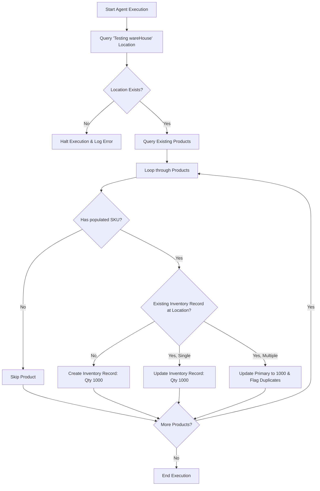

# B2B Commerce Baseline Inventory Configuration
**ID:** B2B-INV-001
**Version:** 1.0
**Status:** Draft
**Type:** Functional Specification

## Overview & Purpose
The organization needs to ensure all existing B2B Commerce products are available for purchase during testing and validation phases by setting up a consistent baseline inventory. Without adequate inventory, products will trigger out-of-stock errors, preventing entitled buyers from successfully executing cart and order flows. This initiative leverages the B2B Commerce Agent to automate the assignment of exactly 1000 units to every existing SKU at the designated 'Testing wareHouse' location, ensuring a standardized environment without creating duplicate records.

## Goals
*   **OBJ-01:** Ensure all existing products have baseline inventory configured for testing. (Measure: 100% of existing SKUs have an associated inventory record at the target location).
*   **OBJ-02:** Standardize inventory levels across the catalog. (Measure: All processed SKUs reflect exactly 1000 units of available inventory at the target location).

## Target Users
*   **B2B Commerce Admin:** Executes the agent, reviews logs, and approves final inventory levels.
*   **Entitled Buyers:** End-users who require product availability during checkout flows (indirect beneficiaries).

## Stakeholders
*   **B2B Commerce Admin:** Decision authority. Concerns include accurate inventory assignment, prevention of duplicate products or locations, and efficient bulk processing.
*   **Entitled Buyers:** No decision authority. Concerns include product availability during checkout flows.

## Scope (In / Out)
**In Scope:**
*   Identifying all existing products with a populated SKU in the B2B Commerce org.
*   Querying and utilizing the existing 'Testing wareHouse' inventory location.
*   Creating or updating inventory records to exactly 1000 units for identified SKUs at the target location.
*   Consolidating/updating primary records if multiple inventory records exist for the same location.

**Out of Scope:**
*   Creation of new products, SKUs, or product categories.
*   Configuration of inventory at any location other than 'Testing wareHouse'.
*   Modification of product pricing or multi-currency configurations.

## MoSCoW
None specified.

## Functional Requirements

*   **FR-01:** The system shall identify all existing products with a populated SKU in the B2B Commerce org.
    *   *Acceptance Criteria:*
        *   **Given** the B2B Commerce Agent queries the product catalog, **When** retrieving records, **Then** it must only return and process products that have a non-null, non-empty SKU value.
*   **FR-02:** The system shall query and utilize the existing inventory location named 'Testing wareHouse'.
    *   *Acceptance Criteria:*
        *   **Given** the agent begins execution, **When** it looks up the target location, **Then** it must successfully retrieve the ID for 'Testing wareHouse' without attempting to create it.
*   **FR-03:** The system shall set the inventory quantity to exactly 1000 for each identified SKU at the 'Testing wareHouse' location.
    *   *Acceptance Criteria:*
        *   **Given** an identified SKU, **When** the agent processes the inventory record, **Then** the resulting available quantity at 'Testing wareHouse' must be exactly 1000, regardless of previous values.
*   **FR-04:** The system shall not create duplicate products, SKUs, or inventory locations during the update process.
    *   *Acceptance Criteria:*
        *   **Given** the agent is executing its updates, **When** it encounters missing records, **Then** it may only create new inventory junction records mapping existing SKUs to the existing location, and must never insert new Product, SKU, or Location records.

## User Stories

*   **US-01:** As a B2B Commerce Admin, I want to use the B2B Commerce Agent to configure inventory for all existing products, so that buyers can successfully purchase items from the Testing wareHouse without encountering out-of-stock errors.
    *   *Acceptance Criteria:*
        *   **Scenario: Set inventory for a product with no existing inventory record**
            *   **Given** an existing product with a SKU and no inventory record at Testing wareHouse, **When** the B2B Commerce Agent processes the product, **Then** a new inventory record is created for the SKU at Testing wareHouse with a target quantity of 1000.
        *   **Scenario: Update inventory for a product with an existing inventory record** *(Proposed — not yet agreed)*
            *   **Given** an existing product with a SKU and an existing inventory record at Testing wareHouse, **When** the B2B Commerce Agent processes the product, **Then** the existing inventory record is updated to exactly 1000 units.
        *   **Scenario: Skip products without a SKU**
            *   **Given** an existing product that does not have a populated SKU, **When** the B2B Commerce Agent evaluates the product, **Then** the product is skipped and no inventory record is created.

## Inputs/Outputs/Data Flow
*   **Inputs:**
    *   Product Catalog Data (Product ID, SKU, Active Status).
    *   Inventory Location Data (Location Name: 'Testing wareHouse').
    *   Existing Inventory Records (Location ID, SKU ID, Quantity).
*   **Outputs:**
    *   New Inventory Records (Qty: 1000).
    *   Updated Inventory Records (Qty: 1000).
    *   Execution Logs (Errors, Duplicate flags, Processed counts).
*   **Data Flow:**
    1. Agent queries Salesforce for the 'Testing wareHouse' location ID.
    2. Agent queries Salesforce for all Products where SKU is not null.
    3. For each Product, Agent queries existing Inventory records at the target location.
    4. Agent performs an upsert/update operation to set the quantity to 1000.
    5. Agent writes execution results and any edge-case flags to the system logs.

## Flows

## Edge Cases & Error States
*   **EC-01: Missing Target Location:** The 'Testing wareHouse' location does not exist in the org.
    *   *Handling:* The agent must halt execution immediately, log an error, and must not create a duplicate or fallback location.
*   **EC-02: Duplicate Inventory Records:** A product has multiple inventory records for the same 'Testing wareHouse' location.
    *   *Handling:* The agent must consolidate or update the primary record to 1000 and flag the duplicate record(s) for admin review.

## Acceptance Criteria (Given/When/Then)
*(Consolidated from User Stories, Functional Requirements, and Edge Cases)*

1.  **Given** the agent is triggered, **When** the 'Testing wareHouse' location does not exist, **Then** the agent halts execution, logs an error, and creates no records.
2.  **Given** an existing product with a populated SKU and no inventory record at Testing wareHouse, **When** processed, **Then** a new inventory record is created for the SKU at Testing wareHouse with a quantity of 1000.
3.  **Given** an existing product with a populated SKU and a single existing inventory record at Testing wareHouse, **When** processed, **Then** the existing inventory record is overwritten to exactly 1000 units.
4.  **Given** an existing product without a populated SKU, **When** evaluated, **Then** the product is skipped and no inventory record is created or modified.
5.  **Given** an existing product with a populated SKU and multiple inventory records at Testing wareHouse, **When** processed, **Then** the primary record is updated to 1000 and the duplicate records are flagged for admin review.
6.  **Given** the agent processes the catalog, **When** execution completes, **Then** no new Products, SKUs, or Locations have been created.

## Non-Functional Requirements
*   **NFR-01 (Performance):** The inventory update process must handle the entire product catalog efficiently without manual intervention. It must process up to 10,000 SKUs in a single batch or agent execution without exceeding Salesforce governor limits.
*   **NFR-02 (Maintainability):** The agent instruction or script must be reusable for future baseline resets. 100% of the execution steps must be documented and repeatable.

## Assumptions
*   **AD-02:** The B2B Commerce Agent has the necessary administrative permissions to read products and write inventory records. (Impact if wrong: The process will fail due to insufficient privileges).

## Dependencies
*   **AD-01:** The 'Testing wareHouse' inventory location is already created and active in the Salesforce org. (Impact if wrong: The agent will fail to assign inventory, blocking checkout testing).

## Open Questions
*   **OQ-01:** If a product already has an inventory quantity other than 1000 at Testing wareHouse, should the agent overwrite it or add 1000 to the existing amount? *(Note: The document recommends overwriting to exactly 1000, but marks this as "Proposed — not yet agreed" in US-01).*
*   **OQ-02:** Should inactive products also receive inventory allocations? *(Note: The document recommends No, but this requires stakeholder confirmation).*
*   **OQ-03:** What is the MoSCoW prioritization for the requirements in this specification? (None specified in the input).

## Success Metrics
*   **SM-01 (Leading):** SKU Inventory Coverage. Target: 100% of active SKUs have an inventory record at Testing wareHouse. (Data required: Product and Inventory Location Record counts).
*   **SM-02 (Lagging):** Checkout Out-of-Stock Errors. Target: 0 errors during UAT related to missing inventory. (Data required: UAT test execution logs).