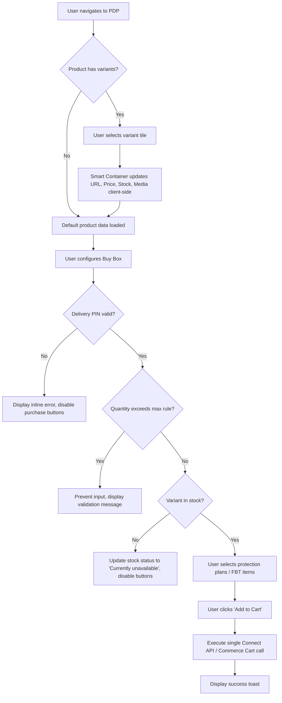

# B2B Commerce Product Detail Page (PDP)

**ID:** SPEC-PDP-001
**Version:** 1.0
**Status:** Draft
**Type:** Functional Specification

## Overview & Purpose
The organization requires a B2B commerce storefront Product Detail Page (PDP) operating within a Salesforce Developer Edition org. The PDP must visually mirror the Amazon Business experience, featuring a highly detailed, component-rich layout that includes a media gallery, complex buy box, variant selectors, and cross-sell carousels (Frequently Bought Together, Related Products). The implementation must strictly adhere to US multi-currency and multi-language configurations, overriding any previous visual references to localized Indian formats. The architecture will strictly follow standard Lightning Web Component (LWC) practices (smart container/dumb child) and prioritize standard Commerce wire adapters over custom Apex.

## Goals
- **OBJ-01:** Deliver a PDP layout that visually replicates the Amazon reference design using Salesforce B2B Commerce data. 100% of in-scope content blocks (hero, buy box, specs, FBT) must be present and styled with a light background and #FF9900 accents.
- **OBJ-02:** Ensure strict compliance with multi-currency and multi-language domain principles. Zero hardcoded currency symbols or English literal strings may exist in templates; 100% of user-facing text must be sourced from Custom Labels or translated CMS content.
- **BR-01:** Currency and locale behavior must strictly follow the US multi-currency configuration (USD corporate).
- **BR-03:** Standard commerce wire adapters and Connect API must be prioritized over custom Apex to reduce technical debt and leverage standard Salesforce caching and security.

## Target Users
- **Entitled B2B Buyer:** Authenticated users viewing accurate contract pricing and stock, selecting variants/add-ons, and purchasing items.
- **Logged-out User (Guest):** Unauthenticated users browsing the public catalog and viewing product specifications without entitlements.

## Stakeholders
- **Entitled B2B Buyer:** Needs to easily evaluate products, select configurations, and add items to the cart. (Decision authority: None)
- **Logged-out User (Guest):** Needs to browse catalog and specifications. (Decision authority: None)
- **Store Administrator:** Needs to configure page layouts, thresholds, and metadata without code deployments. (Decision authority: Approves final Experience Builder configuration and custom metadata structures)

## Scope
**In Scope:**
- Media gallery with thumbnails, main image, and lightbox full-view modal.
- Key specifications table displaying product attributes.
- Client-side product variant selection (Size, Configuration, etc.).
- Sticky Buy Box with quantity selector, protection plan add-ons, and purchase buttons.
- 'Frequently Bought Together' (FBT) dynamic bundle calculation and single-click add-to-cart.
- US multi-currency and multi-language localization support.

**Out of Scope:**
- 3D model rendering or AR viewing.
- AI-generated bundles (using static related product records for v1).
- Amazon-specific monetization features (Sponsored ad slots, Rufus AI assistant, Amazon Pay cashback, Prime-specific delivery badges).
- Third-party JavaScript libraries.
- Custom exception, logger, or error-handling frameworks (must use AuraHandledException).
- Creation of Apex test classes, test data factories, or *.test.js files.

## MoSCoW
None specified.

## Functional Requirements

- **FR-01: Media Gallery Component**
  - **Description:** The system shall display a media gallery component supporting vertical thumbnails, a main image, and a lightbox full-view modal.
  - **Acceptance Criteria:** GIVEN the user is on the PDP, WHEN the media gallery renders, THEN it displays vertical thumbnails and a main image, AND clicking the image opens a full-view lightbox modal.

- **FR-02: Dynamic Pricing Formatting**
  - **Description:** The system shall render product prices using `lightning-formatted-number` bound to the user's active currency, reflecting buyer-group specific entitlements.
  - **Acceptance Criteria:** GIVEN an entitled B2B buyer is viewing a product, WHEN the price is displayed, THEN it is formatted using the active currency (USD) without hardcoded symbols AND reflects the specific buyer-group contract price.

- **FR-03: Client-Side Variant Updates**
  - **Description:** The system shall update the variant state (URL, price, stock, media) client-side via a smart container component when a new variation tile is selected.
  - **Acceptance Criteria:** GIVEN a product with multiple variations, WHEN a user clicks a different variant tile, THEN the URL, price, stock status, and media gallery update immediately without a full page reload.

- **FR-04: Sticky Buy Box**
  - **Description:** The system shall provide a sticky Buy Box containing price, delivery estimate, stock status, quantity selector, protection plan checkboxes, and Add to Cart / Buy Now buttons.
  - **Acceptance Criteria:** GIVEN the user scrolls the PDP, WHEN the Buy Box is in the viewport, THEN it remains accessible and displays all required purchasing inputs and actions.

- **FR-05: Single Transaction Cart Addition**
  - **Description:** The system shall execute a single Connect API / Commerce Cart call to add the main item, selected add-ons, and selected protection plans simultaneously.
  - **Acceptance Criteria:** GIVEN a user has selected a main product and optional protection plans, WHEN they click 'Add to Cart', THEN a single API call is made to add all selected items to the cart simultaneously.

- **FR-06: Frequently Bought Together (FBT) Component**
  - **Description:** The system shall display an FBT component that aggregates the prices of selected related products and provides a single 'Add all to Cart' action.
  - **Acceptance Criteria:** GIVEN complementary items are configured, WHEN the user checks or unchecks items in the FBT section, THEN the total price recalculates immediately AND clicking 'Add all to Cart' adds all selected items.

## User Stories

- **US-01:** As an Entitled B2B Buyer, I want to view the product media gallery and key specifications, so that I can visually and technically evaluate the product before purchase.
  - **Acceptance Criteria:** GIVEN the buyer navigates to the PDP, WHEN the page loads, THEN the media gallery displays thumbnails and a main image, and the key specifications table displays product attributes.

- **US-02:** As an Entitled B2B Buyer, I want to select different product variants (e.g., Size, Configuration), so that I can see the specific price, stock, and images for my desired configuration.
  - **Acceptance Criteria:** GIVEN the buyer is viewing a product with multiple variations, WHEN the buyer clicks a different variant tile, THEN the URL, price, stock status, and media gallery update without a full page reload.

- **US-03:** As an Entitled B2B Buyer, I want to use the Buy Box to configure my purchase, so that I can select quantity, add protection plans, and add the bundle to my cart.
  - **Acceptance Criteria:** GIVEN the buyer has selected a valid, in-stock variant, WHEN the buyer checks a protection plan and clicks 'Add to Cart', THEN both the main product and the protection plan are added to the cart in a single transaction, and a success toast is displayed.

- **US-04:** As an Entitled B2B Buyer, I want to view and interact with the 'Frequently Bought Together' section, so that I can easily add complementary items to my order.
  - **Acceptance Criteria:** GIVEN the product has configured complementary items, WHEN the buyer checks or unchecks items in the FBT section, THEN the dynamic total price recalculates immediately using the buyer's entitled pricing.

## Inputs/Outputs/Data Flow
- **Inputs:** 
  - Standard Salesforce B2B Commerce Cloud data models: `Product2`, `PricebookEntry`, `BuyerGroup`, `CommerceEntitlementPolicy`.
  - User interactions (Variant selection, Quantity input, Add-on selection, Delivery PIN).
  - Custom Labels and translated CMS content for localization.
- **Outputs:** 
  - Cart Items (Main product, Protection Plans, FBT items) sent to Commerce Cart via Connect API.
  - Dynamic UI updates (Price, Stock, Media, Total calculations).

## Flows

## Edge Cases & Error States
- **EC-01 (Out of Stock):** The user selects a product variant combination that is currently out of stock.
  - *Expected:* The Buy Box stock status updates to 'Currently unavailable' in red, and the 'Add to Cart' and 'Buy Now' buttons are disabled.
- **EC-02 (Invalid Delivery PIN):** The user enters a delivery PIN/zip code that is not serviceable.
  - *Expected:* The delivery estimate line displays an inline error message, and purchase buttons are disabled until a valid location is provided.
- **EC-03 (Empty Related Carousel):** A related product carousel (e.g., 'Customers who viewed this item also viewed') returns zero entitled products for the current buyer.
  - *Expected:* The carousel component hides itself entirely rather than displaying an empty state.
- **EC-04 (Maximum Quantity Exceeded):** The user attempts to add a quantity exceeding the product's maximum purchase quantity rule.
  - *Expected:* The quantity selector prevents the input, and an inline validation message is displayed.

## Acceptance Criteria
*(Consolidated from Functional Requirements and User Stories)*
- **Given** the PDP loads, **When** rendering text and prices, **Then** 100% of user-facing text is sourced from Custom Labels/CMS, and prices use `lightning-formatted-number` bound to the active currency.
- **Given** a product with variants, **When** a variant tile is clicked, **Then** the URL, price, stock, and media update client-side without a full page reload.
- **Given** a user interacts with the Buy Box, **When** an out-of-stock variant is selected, **Then** the stock status shows 'Currently unavailable' in red and purchase buttons are disabled.
- **Given** a user configures a purchase, **When** they check a protection plan and click 'Add to Cart', **Then** both items are added to the cart in a single transaction and a success toast appears.
- **Given** the FBT section is displayed, **When** items are checked/unchecked, **Then** the total price recalculates immediately using entitled pricing.
- **Given** a related product carousel returns zero entitled products, **When** the page renders, **Then** the carousel component is completely hidden.

## Non-Functional Requirements
- **NFR-01 (Usability):** All UI layouts must tolerate text expansion to accommodate multi-language translations without breaking the grid or overlapping elements. Target: Tolerates approximately 30% text expansion.
- **NFR-02 (Accessibility):** The PDP must meet WCAG 2.1 AA standards, including semantic landmarks, keyboard operability, visible focus states, alt text for images, and aria-live regions for dynamic price/stock updates. Target: 0 critical or serious accessibility violations in automated Axe scans.
- **NFR-03 (Security):** All custom Apex controllers must enforce FLS/CRUD, use `with sharing`, and execute `WITH USER_MODE`. Target: 100% compliance in static code analysis (e.g., PMD/Checkmarx).
- **NFR-04 (Maintainability):** LWC architecture must strictly follow a smart container/dumb child pattern, where only the container component interacts with data adapters or Apex. Target: 100% of leaf components use only `@api` inputs and `CustomEvents`.
- **NFR-05 (Performance):** Above-the-fold content (gallery, summary, buy box) must render quickly, with below-the-fold carousels lazy-loading. Target: Interactive < 2.5 seconds on a 4G connection.

## Assumptions
- **AD-02:** Standard LWC practices will be used for the ASDF framework placeholders until specifics are provided. (Impact if wrong: Components may need to be refactored to comply with the proprietary framework once defined).
- **AD-03:** Standard SLDS tokens and Salesforce icons will be used for styling and iconography until the custom CSS approach is decided. (Impact if wrong: Visual discrepancies may occur, requiring CSS refactoring later).

## Dependencies
- **AD-01:** Standard Salesforce B2B Commerce Cloud data models (`Product2`, `PricebookEntry`, `BuyerGroup`, `CommerceEntitlementPolicy`) are fully configured and populated. (Impact if wrong: Custom Apex and standard wire adapters will fail to retrieve entitled products and pricing).

## Open Questions
- **OQ-01:** How should guest (logged-out) users be handled regarding pricing and the Buy Box? *(Recommended default: Hide prices, 'Add to Cart', and 'Buy Now' buttons for guest users, replacing them with a 'Log in to view pricing' prompt).*
- **OQ-02:** Should the 'Buy Now' button bypass the cart entirely, or redirect to checkout including existing cart items? *(Recommended default: Redirect to checkout with all existing cart items included, to avoid complex separate cart state management).*
- **OQ-03:** For B2B buyers, should we display consumer-style EMI options or account payment terms (e.g., Net 30)? *(Recommended default: Display account payment terms sourced from the buyer's account profile).*
- **OQ-04:** How are protection plans and add-on services modeled in the catalog? *(Recommended default: Model them as standard Product2 records linked to the main product via a custom `Related_Product__c` junction object).*
- **OQ-05:** Does the project utilize the MoSCoW prioritization framework for these requirements? *(None specified in the provided documentation).*

## Success Metrics
- **SM-01 (Leading):** Above-the-fold page load time. Target: < 2.5 seconds. (Data required: Browser performance metrics like LCP, TTI captured via standard analytics).
- **SM-02 (Lagging):** Add to Cart conversion rate from PDP. Target: Baseline + 5%. (Data required: Web analytics tracking 'Add to Cart' events divided by total PDP views).