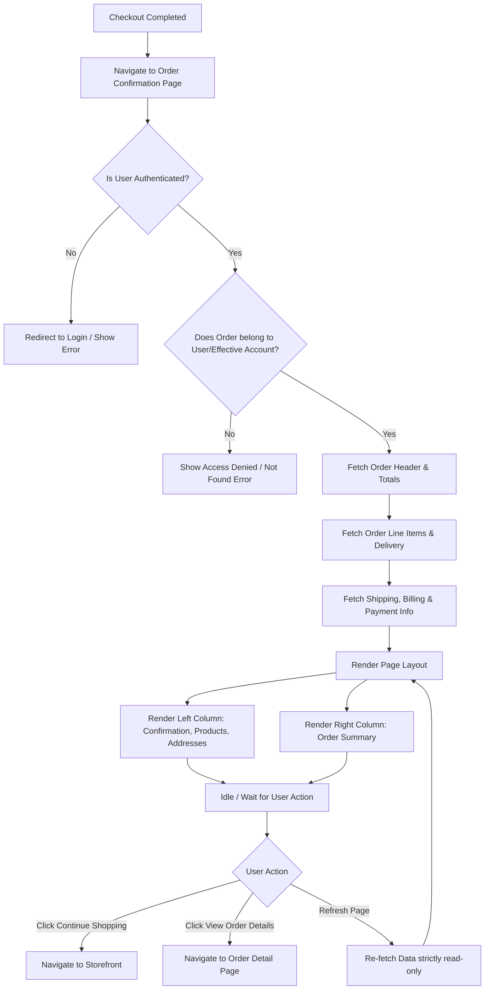

# B2B Order Confirmation Page (Amazon Business Style)

**ID:** B2B-ORD-CONF-001
**Version:** 1.0
**Status:** Draft
**Type:** Functional Specification

---

## Overview & Purpose
Create a clean, simple, business-oriented Order Confirmation page inspired by the Amazon Business purchasing experience. The page will utilize existing Salesforce B2B Commerce standard Order Confirmation components wherever possible, introducing customization (via Configuration, Flow, LWC, or Apex) only when standard components cannot satisfy the specific layout, styling, or data requirements.

---

## Goals
* Clearly confirm successful order placement to the buyer.
* Display critical order information (order number, date, total, ship-to).
* Display ordered products, pricing, and estimated delivery details.
* Display shipping, billing, and payment/PO information in a clear, horizontal layout.
* Clearly display the final order total and summary breakdown.
* Provide clear "Continue Shopping" and "View Order Details" navigation.
* Deliver a simple, clean, professional B2B experience using a specific Amazon Business-style layout and color palette.

---

## Target Users
* **Authenticated B2B Buyers:** Users who have successfully completed the checkout process and are viewing the confirmation of their placed order.

---

## Stakeholders
None specified.

---

## Scope

**In Scope:**
* Two-column page layout implementation.
* Order Confirmation header section.
* Delivery and Ordered Products list section.
* Shipping, Billing, and Payment details section.
* Order Summary card section.
* "Continue Shopping" and "View Order Details" navigation actions.
* Enforcement of Salesforce Commerce security and record access rules (user/account data isolation).
* Prevention of duplicate order creation on page refresh.
* Application of specific typography, spacing, and color palette requirements.

**Out of Scope:**
* Order History page or list views.
* Modifications to the actual checkout or order creation logic (order is assumed to be created prior to reaching this page).

---

## MoSCoW
None specified.

---

## Functional Requirements

### FR1: Page Layout Structure
The page must render a two-column layout. The left column contains the Order Confirmation, Delivery/Products, and Shipping/Billing/Payment sections. The right column contains the Order Summary card.
* **Acceptance Criteria:**
  * **Given** a buyer lands on the Order Confirmation page, **When** the page renders, **Then** the layout is split into a wider left column and a narrower right column.
  * **Given** the page is rendering, **When** viewed on a standard desktop viewport, **Then** the Order Summary card remains visually smaller than the main order content on the left.

### FR2: Order Confirmation Section (Section 1)
The top-left section must display a success confirmation message and high-level order details.
* **Acceptance Criteria:**
  * **Given** a successfully placed order, **When** the Order Confirmation section renders, **Then** it must display a Success Icon, the text "Order placed, thank you!", Order Number, Order Date, Total, and "Ship To" name/identifier.

### FR3: Delivery and Ordered Products Section (Section 2)
Located below Section 1, this section must list the delivery estimate and the specific items ordered.
* **Acceptance Criteria:**
  * **Given** an order with line items, **When** Section 2 renders, **Then** it must display the Estimated delivery date, Shipping method, and Shipping charges at the top of the section.
  * **Given** the line items are rendering, **When** displaying each product, **Then** it must show the Product image, Product name, SKU/Product Code, Quantity, and Product price.

### FR4: Shipping, Billing, and Payment Section (Section 3)
Located below Section 2, this section must display three sub-sections in a single horizontal row.
* **Acceptance Criteria:**
  * **Given** the order details are loaded, **When** Section 3 renders, **Then** Shipping Address, Billing Address, and Payment Method must be displayed side-by-side horizontally.
  * **Given** the Shipping Address sub-section, **When** rendered, **Then** it displays the shipping address and the phone number (if available).
  * **Given** the Billing Address sub-section, **When** rendered, **Then** it displays the billing address and the email address (if available).
  * **Given** the Payment Method sub-section, **When** rendered, **Then** it displays the payment method and the PO Number (if applicable).

### FR5: Order Summary Section (Section 4)
Located in the right column, this card must display the financial breakdown of the order.
* **Acceptance Criteria:**
  * **Given** the order financials are calculated, **When** the Order Summary renders, **Then** it must display Items total, Shipping & Handling, Total Before Tax, Estimated Tax, and Grand Total.

### FR6: Navigation Actions
The page must provide specific navigation buttons/links to allow the user to continue their journey.
* **Acceptance Criteria:**
  * **Given** the Order Summary card is rendered, **When** the user views the bottom of the card, **Then** a "Continue Shopping" button must be clearly visible.
  * **Given** the user clicks "Continue Shopping", **When** the action is triggered, **Then** the user is navigated back to the storefront/catalog.
  * **Given** the page is rendered, **When** configured/available, **Then** a "View Order Details" link or button must be provided.

### FR7: Security and Data Access
The page must strictly enforce data visibility rules based on the authenticated user and their effective account.
* **Acceptance Criteria:**
  * **Given** User A is authenticated under Account A, **When** they attempt to access the Order Confirmation page for an order belonging to User B or Account B, **Then** the system must deny access and not display the order information.
  * **Given** an authenticated buyer, **When** the page loads, **Then** it must only query and display information for the currently authenticated buyer and correct effective Account.

### FR8: Idempotent Refresh Behavior
Refreshing the page must strictly be a read-only operation.
* **Acceptance Criteria:**
  * **Given** a buyer is on the Order Confirmation page, **When** they refresh the browser, **Then** the system must only retrieve existing order information and must *not* create a duplicate order or trigger secondary checkout processing.

---

## User Stories

**US1: View Order Confirmation**
* **As an** authenticated B2B buyer
* **I want** to see a clear confirmation that my order was placed, along with the order number and total
* **So that** I have immediate peace of mind and a reference number for my records.
* **Acceptance Criteria:**
  * **Given** I have completed checkout, **When** the page loads, **Then** I see "Order placed, thank you!" with a green success icon.
  * **Given** the confirmation section is visible, **When** I read the details, **Then** I see the Order Number, Order Date, Total, and Ship To information.

**US2: Review Ordered Items and Delivery**
* **As an** authenticated B2B buyer
* **I want** to see the estimated delivery dates, shipping methods, and a list of the products I just bought
* **So that** I can verify exactly what is arriving and when.
* **Acceptance Criteria:**
  * **Given** I am viewing the confirmation page, **When** I look at the Delivery section, **Then** I see the arriving date range, shipping method, and shipping cost.
  * **Given** I am viewing the products list, **When** I check an item, **Then** I see its image, name, SKU, quantity, and unit price.

**US3: Verify Addresses and Payment**
* **As an** authenticated B2B buyer
* **I want** to see my shipping address, billing address, and payment/PO details in a single row
* **So that** I can quickly confirm the logistical and financial routing of the order.
* **Acceptance Criteria:**
  * **Given** I am viewing the confirmation page, **When** I scroll to the bottom left, **Then** I see three horizontal blocks for Shipping, Billing, and Payment.
  * **Given** I used a PO Number for the purchase, **When** I look at the Payment block, **Then** the PO Number is explicitly listed.

**US4: Continue Shopping**
* **As an** authenticated B2B buyer
* **I want** a prominent button to continue shopping
* **So that** I can easily return to the catalog to make additional purchases.
* **Acceptance Criteria:**
  * **Given** I am on the confirmation page, **When** I look at the Order Summary card on the right, **Then** I see a yellow "Continue Shopping" button.
  * **Given** I click the "Continue Shopping" button, **When** the click is registered, **Then** I am redirected to the main shopping area.

---

## Inputs/Outputs/Data Flow

**Inputs:**
* `OrderID` (passed via URL parameter or session context from checkout).
* `UserID` (Current authenticated user context).
* `EffectiveAccountID` (Current active account context).

**Outputs:**
* `OrderHeader`: Order Number, Order Date, Status.
* `OrderTotals`: Items Subtotal, Shipping & Handling, Total Before Tax, Estimated Tax, Grand Total.
* `OrderShipping`: Shipping Address, Phone, Estimated Delivery Date, Shipping Method, Shipping Charges.
* `OrderBilling`: Billing Address, Email.
* `OrderPayment`: Payment Method Name, PO Number.
* `OrderLineItems`: Array of objects containing Product Image URL, Product Name, SKU, Quantity, Unit Price.

**Data Flow:**
1. Page initializes with `OrderID`.
2. System validates `UserID` and `EffectiveAccountID` against the `OrderID` owner/account.
3. If authorized, system queries Salesforce B2B Commerce standard objects (Order, OrderDeliveryGroup, OrderItem, etc.).
4. Data is mapped to the UI components (OOTB or Custom LWC).
5. UI renders the two-column layout.

---

## Flows

---

## Edge Cases & Error States

* **Missing Phone Number:**
  * *Condition:* The shipping address record does not contain a phone number.
  * *Handling:* Hide the phone number field gracefully without leaving empty labels or broken formatting.
  * *Acceptance Criteria:* **Given** an order with no shipping phone number, **When** the Shipping Address section renders, **Then** only the address is displayed and no blank "Phone:" label is shown.
* **Missing Email Address:**
  * *Condition:* The billing address record does not contain an email address.
  * *Handling:* Hide the email address field gracefully.
  * *Acceptance Criteria:* **Given** an order with no billing email, **When** the Billing Address section renders, **Then** only the address is displayed and no blank "Email:" label is shown.
* **No PO Number Provided:**
  * *Condition:* The order was paid via Credit Card or another method not requiring a PO.
  * *Handling:* Display only the Payment Method; omit the PO Number line.
  * *Acceptance Criteria:* **Given** an order without a PO Number, **When** the Payment section renders, **Then** only the Payment Method is displayed.
* **Missing Product Image:**
  * *Condition:* A product in the order line items lacks an image URL.
  * *Handling:* Display a standard fallback/placeholder image.
  * *Acceptance Criteria:* **Given** a product without an image, **When** the Ordered Products section renders, **Then** a default placeholder image is displayed in its place.
* **Unauthorized Access Attempt:**
  * *Condition:* A user manipulates the URL to view an `OrderID` belonging to another account.
  * *Handling:* Block access and display a standard Salesforce B2B Commerce error/not found state.
  * *Acceptance Criteria:* **Given** a user alters the Order ID in the URL to one they do not own, **When** the page attempts to load, **Then** an error message is displayed and no order data is leaked.

---

## Acceptance Criteria
*(Note: Specific functional acceptance criteria are detailed inline within the Functional Requirements and User Stories sections. The following represent overarching page-level criteria.)*

* **Given** a completed checkout, **When** the Order Confirmation page loads, **Then** the layout strictly follows the defined two-column structure and Amazon Business-style visual hierarchy.
* **Given** the page is rendering, **When** applying styles, **Then** the exact hex codes specified in the Color Palette (NFRs) must be utilized.
* **Given** a user refreshes the browser on the confirmation page, **When** the page reloads, **Then** the order data is re-displayed and no duplicate order is generated in the backend.
* **Given** standard Salesforce B2B Commerce components exist for a required data point, **When** the page is implemented, **Then** the standard component is used in preference to custom LWC or Apex.

---

## Non-Functional Requirements

### UI/UX & Styling
* **Color Palette:** Must strictly adhere to the following hex codes to prevent an "overly colorful" appearance:
  * Page Background: `#F3F3F3`
  * Card Background: `#FFFFFF`
  * Primary Text: `#111111`
  * Secondary Text: `#565959`
  * Border: `#D5D9D9`
  * Success Icon: `#008A5A`
  * Success Text: `#007600`
  * Primary Button: `#FFD814`
  * Button Hover: `#F7CA00`
  * Button Text: `#111111`
  * Link/Text Accent: `#007EB9`
  * Grand Total: `#C45500`
* **Typography:** Clean, readable sans-serif font.
  * Page/confirmation heading: 20–24px.
  * Section heading: 16–18px.
  * Body text: 14px.
  * Secondary information: 12–14px.
  * Grand Total: 18px and bold.
  * Product name: 14–16px.
* **Spacing & Cards:**
  * Page padding: 24–32px.
  * Card padding: 16–20px.
  * Space between cards: 12–16px.
  * Card styling: Background `#FFFFFF`, Border `#D5D9D9`, Radius 6–8px, Minimal or no shadow.
* **Button Styling (Continue Shopping):** Background `#FFD814`, Hover `#F7CA00`, Text `#111111`, Border `#F0B800`, Rounded corners, Medium font weight.

### Architecture & Implementation Priority
Implementation must follow this strict hierarchy of evaluation to minimize technical debt:
1. **OOTB B2B Commerce:** Use standard components if they provide the required information.
2. **Configuration:** Rearrange/configure standard components to achieve layout.
3. **Flow:** Use for declarative processing/logic.
4. **Custom LWC:** Create only if standard components/config cannot meet requirements.
5. **Apex / API:** Use only to retrieve/process info unavailable through standard Commerce capabilities.

---

## Assumptions
* The underlying platform is Salesforce B2B Commerce.
* The checkout process successfully creates the order and handles all payment processing *before* redirecting the user to this Order Confirmation page.
* Standard Salesforce B2B Commerce standard components can be styled or wrapped to meet the specific color and typography requirements, or custom LWCs will be built following the implementation priority if styling standard components is not possible.

---

## Dependencies
* Salesforce B2B Commerce platform and its standard object model (Order, OrderItem, etc.).
* Successful completion of the upstream Checkout flow.

---

## Open Questions
* Who are the specific stakeholders for sign-off on this page?
* What is the MoSCoW prioritization for the individual data elements if some are exceptionally difficult to retrieve via standard components?
* What are the specific Success Metrics for this implementation?
* What is the exact URL routing path for the "Continue Shopping" button (e.g., home page, specific catalog category, or previous page)?
* If a standard component provides the required data but cannot be styled to match the exact Amazon Business layout/colors, should the team prioritize the OOTB component (sacrificing design) or build a custom LWC (sacrificing OOTB priority)?

---

## Success Metrics
None specified.