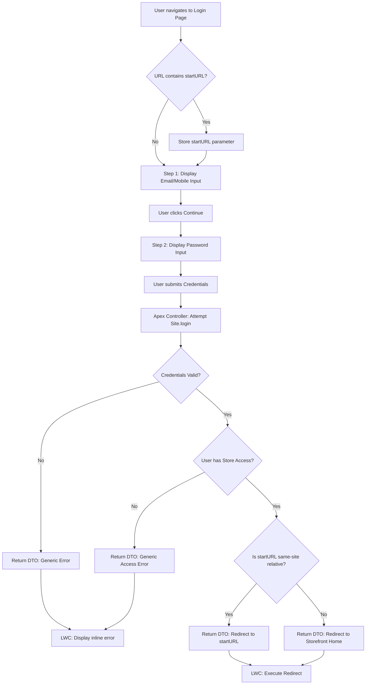

# Custom B2B Authentication & Login Experience

**ID:** B2B-AUTH-001
**Version:** 1.0
**Status:** Draft
**Type:** Functional Specification

## Overview & Purpose
B2B buyers require a secure, branded method to authenticate into the Amazon Replica storefront to access their contracted pricing, catalogs, and account details. The out-of-the-box Salesforce Experience Cloud login page does not align with the required Amazon visual identity or the desired two-step authentication flow. This specification defines a custom login experience utilizing custom Lightning Web Components (LWC) and a secure Apex controller to ensure brand consistency, guard against open-redirect vulnerabilities, and prevent user enumeration through generic error handling.

## Goals
*   **OBJ-01:** Provide a secure, branded authentication experience for B2B buyers. (Measure: 100% of successful logins route the user to the correct authenticated context or their requested deep link).
*   **OBJ-02:** Match the Amazon sign-in visual identity. (Measure: 0 deviations from the specified reference design, including centered card, wordmark, and specific button styling).

## Target Users
*   **B2B Buyer:** End-users accessing the storefront to view business accounts, contract pricing, products, and complete checkout.

## Stakeholders
*   **B2B Buyer:**
    *   *Decision authority:* None
    *   *Concerns:* Ease of logging in; Clear error messages; Ability to reset forgotten passwords.
*   **Security Team:**
    *   *Decision authority:* Approves `startURL` sanitization and generic error message phrasing.
    *   *Concerns:* Prevention of open-redirect attacks; Prevention of user enumeration via login errors; Secure handling of credentials.

## Scope

**In Scope:**
*   Two-step authentication flow (Step 1: Email/Mobile, Step 2: Password).
*   Custom Lightning Web Component (LWC) UI matching Amazon visual identity.
*   Secure Apex login controller returning a typed Result DTO.
*   `startURL` sanitization for same-site relative paths.
*   Forgot password flow triggering standard Salesforce reset emails.
*   Generic inline error messaging for authentication failures.

**Out of Scope:**
*   Self-registration functionality.
*   Account creation links or flows.
*   Social login or Single Sign-On (SAML/Auth Providers) configurations.

## MoSCoW
None specified.

## Functional Requirements

*   **FR-01: Two-Step Login Form**
    *   The system shall display a two-step login form, capturing email/mobile in step one and password in step two.
    *   *Acceptance Criteria:* Verify that the user cannot enter the password until the email/mobile step is submitted.
*   **FR-02: StartURL Sanitization**
    *   The system shall sanitize the `startURL` parameter to allow only same-site relative paths.
    *   *Acceptance Criteria:* Verify that absolute URLs or external domains passed in `startURL` are stripped or rejected, defaulting the user to the storefront home.
*   **FR-03: Forgot Password Flow**
    *   The system shall provide a 'forgot password' flow that triggers a standard Salesforce password reset email.
    *   *Acceptance Criteria:* Verify that submitting a valid email address through the forgot password link displays a confirmation message and sends the standard Salesforce reset email.
*   **FR-04: Generic Error Messaging**
    *   The system shall display generic inline error messages for authentication failures without revealing whether the username exists, is inactive, or is locked out.
    *   *Acceptance Criteria:* Verify that invalid passwords, non-existent users, and locked-out users all produce the exact same inline error message.
*   **FR-05: Hide Registration Links**
    *   The system shall hide all self-registration and account creation links on the login page.
    *   *Acceptance Criteria:* Verify no "Sign Up" or "Create Account" links exist in the DOM of the login component.
*   **FR-06: Typed Result DTO**
    *   The system shall return a typed result DTO from the Apex login controller to the LWC.
    *   *Acceptance Criteria:* Verify the Apex controller response is a structured DTO containing success boolean, error message string (if applicable), and redirect URL.

## User Stories

*   **US-01:** As a B2B Commerce buyer, I want to securely log in to the storefront, so that I can access my business account, contract pricing, products, cart, and checkout.
    *   *Given* I am on the custom login page *When* I enter my valid email/mobile in step 1 and my valid password in step 2 *Then* I am authenticated and redirected to the storefront home or my requested startURL.
    *   *Given* I enter invalid credentials, am inactive, or lack store access *When* I attempt to log in *Then* I see a generic inline error message that does not specify which factor failed.
    *   *Given* I click a deep link to a specific product before logging in *When* I successfully complete the login flow *Then* I am redirected to the specific product page I originally requested.
*   **US-02:** As a B2B Commerce buyer, I want to request a password reset, so that I can regain access to my account if I forget my password.
    *   *Given* I have forgotten my password *When* I submit my email address through the forgot password flow *Then* I receive a password reset email and see a confirmation message on the screen.

## Inputs/Outputs/Data Flow

**Inputs:**
*   `username` (String): Captured in Step 1 (Email or Mobile).
*   `password` (String): Captured in Step 2.
*   `startURL` (String): URL parameter captured on page load.

**Outputs:**
*   `ResultDTO` (Object): Returned from Apex to LWC containing `isSuccess` (Boolean), `errorMessage` (String), and `redirectUrl` (String).
*   `AuthSession`: Standard Salesforce session cookie established upon successful `Site.login()`.
*   Password Reset Email: Triggered via standard Salesforce functionality.

## Flows

## Edge Cases & Error States

*   **EC-01: Invalid or External startURL**
    *   *Condition:* User enters an invalid or external `startURL` (e.g., an absolute URL to a malicious site).
    *   *Handling:* The system strips or rejects the URL and redirects the user to the default storefront home page.
*   **EC-02: User Lockout**
    *   *Condition:* User is locked out due to too many failed login attempts.
    *   *Handling:* The system displays the standard generic inline error message without confirming the lockout state to the unauthenticated user.
*   **EC-03: Missing Store Access**
    *   *Condition:* User successfully authenticates but has no store access (e.g., not assigned to a Buyer Group).
    *   *Handling:* The system prevents access to the storefront and displays a generic access error.

## Acceptance Criteria (Given/When/Then)

*   **AC-01 (Happy Path Login):** Given I am on the custom login page, When I enter my valid email/mobile in step 1 and my valid password in step 2, Then I am authenticated and redirected to the storefront home or my requested startURL.
*   **AC-02 (Deep Link Redirect):** Given I click a deep link to a specific product before logging in, When I successfully complete the login flow, Then I am redirected to the specific product page I originally requested.
*   **AC-03 (Generic Error - Invalid Credentials):** Given I enter invalid credentials, When I attempt to log in, Then I see a generic inline error message that does not specify which factor failed.
*   **AC-04 (Generic Error - Lockout):** Given my account is locked out, When I attempt to log in, Then I see the exact same generic inline error message as an invalid credential attempt.
*   **AC-05 (Access Error - No Buyer Group):** Given I have valid credentials but no store access, When I attempt to log in, Then I am not granted storefront access and see a generic access error.
*   **AC-06 (Malicious startURL):** Given I access the login page with an external domain in the `startURL` parameter, When I successfully log in, Then I am redirected to the default storefront home page instead of the external domain.
*   **AC-07 (Forgot Password):** Given I have forgotten my password, When I submit my email address through the forgot password flow, Then I receive a password reset email and see a confirmation message on the screen.

## Non-Functional Requirements

*   **NFR-01 (Usability):** The login form must match the Amazon sign-in reference design, including a centered card, Amazon wordmark, and full-width yellow 'Continue' button. (Target: 100% alignment with provided visual specifications).
*   **NFR-02 (Accessibility):** The login page must meet WCAG 2.1 AA standards, including labeled inputs, visible focus states, and `aria-describedby` for inline errors. (Target: 0 accessibility violations reported by standard auditing tools).
*   **NFR-03 (Security):** The Apex controller must enforce CRUD/FLS, run `with sharing`, and contain no hardcoded credentials or org secrets. (Target: 100% compliance with Salesforce security review guidelines).
*   **NFR-04 (Maintainability):** An Apex test class (`AmazonB2BLoginControllerTest`) must be created covering positive and negative paths. (Target: Minimum 90% code coverage for the login controller).

## Assumptions

*   **AD-01:** Experience Cloud site Login & Registration settings must be configured to route to the custom `lightningCommunity__Page`. (Impact if wrong: Users will see the default Salesforce login page instead of the custom Amazon-branded experience).
*   **AD-02:** B2B Buyer Accounts, Contacts, and Community Users are properly provisioned with the 'Customer Community Plus Login User' profile and appropriate Permission Sets. (Impact if wrong: Valid users will fail to authenticate or will lack access to the storefront catalog and pricing).

## Dependencies

*   **AD-01:** Experience Cloud site Login & Registration settings configuration.
*   **AD-02:** B2B Buyer Accounts, Contacts, and Community Users provisioning.

## Open Questions

*   **OQ-01:** The project context explicitly forbids creating Apex test classes, but NFR-04 requests `AmazonB2BLoginControllerTest` with positive + negative paths, 90%+ coverage. Which rule should take precedence? *(Recommended default from requirements: Follow the specific requirement to create the test class, as it represents the most recent and explicit intent for this feature).*
*   **OQ-02:** The requirement mentions "Enter mobile number or email" for the first step. Standard Salesforce `Site.login` typically expects a single username. Should mobile number login be supported via a custom lookup before calling `Site.login`? *(Recommended default from requirements: Treat the input as the standard Salesforce username. If mobile login is strictly required, implement a custom lookup to map the mobile number to a username before authentication).*
*   **OQ-03:** What is the MoSCoW prioritization for the listed requirements? (None specified in the provided documentation).

## Success Metrics

*   **SM-01 (Lagging):** Login Success Rate. Target: >95% of login attempts succeed. (Data required: Experience Cloud site login history and authentication logs).
*   **SM-02 (Leading):** Password Reset Usage. Target: <5% of login attempts trigger a password reset. (Data required: Usage metrics for the forgot password component).