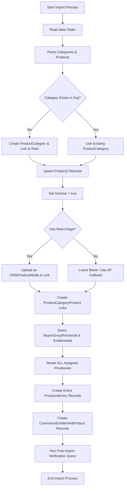

# Devstore Product Catalog Import

**ID:** SPEC-001
**Version:** 1.0
**Status:** Draft
**Type:** Functional Specification

## Overview & Purpose
The project requires populating the existing Salesforce B2B Commerce Cloud storefront ('Devstore') with product data sourced from a local `data/` folder. Previously, incomplete data imports led to critical storefront issues, such as invisible products due to inactive status and broken 'Add to Cart' functionality caused by missing pricebook entries. This requirement defines a robust, end-to-end import process that ensures all categories, products, images, pricebooks, and entitlements are correctly created and linked, guaranteeing a seamless purchasing experience for entitled buyers.

## Goals
*   **OBJ-01:** Successfully import all products and categories from the `data/` folder into the Devstore environment. (Measure: 100% of products and categories in the `data/` folder exist as active records in the org).
*   **OBJ-02:** Ensure all imported products are fully purchasable by entitled buyers without errors. (Measure: 100% of imported products have active PricebookEntry records in all assigned buyer group pricebooks and valid CommerceEntitlementProduct records).

## Target Users
*   **Store Administrator:** Manages the storefront, executes the import, and verifies the catalog structure.
*   **B2B Buyer:** Browses the storefront, views product details, and adds products to the cart.

## Stakeholders
*   **Store Administrator**
    *   *Decision authority:* Approves the data import execution and verifies the catalog structure.
    *   *Concerns:* Accurate product catalog hierarchy; Correct mapping of product specifications and images; Reliable import process without manual data fixing.
*   **B2B Buyer**
    *   *Decision authority:* None.
    *   *Concerns:* Ability to view accurate product details; Ability to successfully add products to the cart without errors.

## Scope
**In Scope:**
*   Reading product and category data from a local `data/` folder.
*   Creation and linking of `ProductCategory` records under the existing catalog root.
*   Creation or updating of `Product2` records with mapped standard and custom fields.
*   Uploading and linking of real image files as CMS content/ProductMedia.
*   Creation of `PricebookEntry` records for all pricebooks assigned to the store's buyer groups.
*   Creation of `CommerceEntitlementProduct` records.
*   Automated post-import verification querying.

**Out of Scope:**
*   Creation of new Devstore environments, WebStores, or Buyer Groups.
*   Modification of existing custom field definitions on the `Product2` object.
*   Translation of product data into multiple languages during this specific import step.

## MoSCoW
None specified.

## Functional Requirements
*   **FR-01:** The system shall read categories from the `data/` folder and create any missing `ProductCategory` records under the existing catalog root, linking them via `ProductCatalog`/`WebStoreCatalog`.
*   **FR-02:** The system shall create or update `Product2` records for each product in the `data/` folder, mapping Name, SKU, Description, and custom specification fields (e.g., `Brand__c`, `Colour__c`).
*   **FR-03:** The system shall set `IsActive = true` on every imported `Product2` record. (Business Rule: BR-01).
*   **FR-04:** The system shall upload real image files from the `data/` folder as ProductMedia or CMS content and link them to the product, avoiding SVG placeholders for products with real photos.
*   **FR-05:** The system shall link each `Product2` record to its corresponding `ProductCategory` via a `ProductCategoryProduct` record.
*   **FR-06:** The system shall query `BuyerGroupPricebook` and create an active `PricebookEntry` for each product in every pricebook assigned to the store's buyer groups. (Business Rule: BR-02).
*   **FR-07:** The system shall create a `CommerceEntitlementProduct` record for each product under the policy assigned to the buyer group's `CommerceEntitlementBuyerGroup`.
*   **FR-08:** The system shall execute a post-import verification query to confirm `IsActive=true`, active `PricebookEntry` existence in assigned pricebooks, and `CommerceEntitlementProduct` existence for at least one sample product.

## User Stories
*   **US-01:** As a Store Administrator, I want to import product categories from the data folder, so that the storefront catalog hierarchy is accurately reflected.
    *   *Acceptance Criteria:* GIVEN the data folder contains category references WHEN the import process runs THEN missing ProductCategory records are created under the existing catalog root and linked via ProductCatalog/WebStoreCatalog.
*   **US-02:** As a Store Administrator, I want to import products and their images, so that buyers can view accurate product details and specifications.
    *   *Acceptance Criteria:* GIVEN a product exists in the data folder with specifications and a real photo WHEN the import process runs THEN a Product2 record is created or updated with IsActive=true, custom fields mapped, and the real image uploaded as CMS content/ProductMedia.
*   **US-03:** As a Store Administrator, I want to assign imported products to all relevant pricebooks and entitlement policies, so that entitled buyers can successfully purchase them without Add to Cart errors.
    *   *Acceptance Criteria:* GIVEN an active imported product WHEN the import process handles pricing and entitlements THEN active PricebookEntry records are created for every pricebook assigned to the store's buyer groups, and a CommerceEntitlementProduct record is created.

## Inputs/Outputs/Data Flow
*   **Inputs:** Local `data/` folder containing product metadata, category definitions, and image files.
*   **Outputs:** Salesforce Records (`Product2`, `ProductCategory`, `ProductCategoryProduct`, `ProductMedia`/CMS Content, `PricebookEntry`, `CommerceEntitlementProduct`).
*   **Data Flow:** The system reads the local folder, processes categories to build the hierarchy, upserts products with mapped fields and active status, uploads and links media, establishes category relationships, queries existing buyer group configurations to generate pricebook entries and entitlements, and finally runs a verification query.

## Flows

## Edge Cases & Error States
*   **EC-01 (Category already exists):** A category referenced in the data folder already exists in the org. The system must link the product to the existing `ProductCategory` record instead of creating a duplicate.
*   **EC-02 (Missing real image):** A product in the data folder lacks a real image file. The system must leave the image relationship blank or use the standard Salesforce fallback, without generating a custom SVG placeholder.
*   **EC-03 (Multiple pricebooks):** The buyer group is assigned multiple pricebooks. The system must iterate through all assigned pricebooks and create an active `PricebookEntry` in each one.

## Acceptance Criteria (Given/When/Then)
*   **AC-FR-01:** GIVEN a category in the `data/` folder does not exist in the org WHEN the import runs THEN a new `ProductCategory` is created under the catalog root and linked via `ProductCatalog`/`WebStoreCatalog`.
*   **AC-FR-02:** GIVEN a product in the `data/` folder WHEN the import runs THEN a `Product2` record is created or updated with Name, SKU, Description, and custom fields mapped.
*   **AC-FR-03:** GIVEN an imported product WHEN the record is saved THEN the `IsActive` flag is set to `true`.
*   **AC-FR-04:** GIVEN a product with a real photo in the `data/` folder WHEN the import runs THEN the image is uploaded as CMS content/ProductMedia and linked to the product.
*   **AC-FR-05:** GIVEN an imported product and its defined category WHEN the import runs THEN a `ProductCategoryProduct` record is created linking them.
*   **AC-FR-06:** GIVEN an imported product WHEN pricing is processed THEN an active `PricebookEntry` is created for every pricebook assigned to the store's buyer groups.
*   **AC-FR-07:** GIVEN an imported product WHEN entitlements are processed THEN a `CommerceEntitlementProduct` record is created under the policy assigned to the buyer group's `CommerceEntitlementBuyerGroup`.
*   **AC-FR-08:** GIVEN the import process has completed WHEN the verification step executes THEN it successfully queries at least one sample product confirming `IsActive=true`, active `PricebookEntry` existence, and `CommerceEntitlementProduct` existence.
*   **AC-EC-01:** GIVEN a category referenced in the data folder already exists in the org WHEN the import runs THEN the system links the product to the existing `ProductCategory` record instead of creating a duplicate.
*   **AC-EC-02:** GIVEN a product in the data folder lacks a real image file WHEN the import runs THEN the system leaves the image relationship blank or uses the standard Salesforce fallback, without generating a custom SVG placeholder.
*   **AC-EC-03:** GIVEN the buyer group is assigned multiple pricebooks WHEN the import runs THEN the system iterates through all assigned pricebooks and creates an active `PricebookEntry` in each one.

## Non-Functional Requirements
*   **NFR-01 (Maintainability):** The import process must be bulk-safe and contain no SOQL or DML operations inside loops. (Target: 0 SOQL/DML statements inside loops during execution).
*   **NFR-02 (Usability):** Product images must reflect real photos where available, ensuring high visual fidelity. (Target: 100% of products with real photos in the data folder use those photos instead of SVG placeholders).

## Assumptions
*   **AD-01:** The Devstore org has an existing catalog root, buyer group, and entitlement policy configured. (Impact if wrong: The import process will fail to link products to the storefront, pricing, and entitlements).
*   **AD-02:** Custom fields such as `Brand__c`, `Colour__c`, `RAM_Memory__c`, etc., already exist on the `Product2` object. (Impact if wrong: The import process will throw field-not-found errors when attempting to map specification data).

## Dependencies
*   **AD-01:** Existing catalog root, buyer group, and entitlement policy configuration in the target Salesforce org.
*   **AD-02:** Pre-existing custom field schema on the `Product2` object.

## Open Questions
*   **OQ-01:** What currency ISO code should be used for the `PricebookEntry` records? (Recommended default: Use the corporate currency (USD) as specified in the project context).
*   **OQ-02:** Should the import process handle updates to existing products, or only inserts? (Recommended default: Perform an upsert operation based on the product SKU to ensure existing records are updated without creating duplicates).
*   **OQ-03:** What is the MoSCoW prioritization for the requirements in this specification? (None specified in the provided documentation).

## Success Metrics
*   **SM-01 (Leading) - Product Import Success Rate:** Target is 100% of products in the `data/` folder are successfully inserted or updated in the org. (Data required: Count of files in `data/` vs. count of updated `Product2` records).
*   **SM-02 (Lagging) - Add to Cart Error Rate:** Target is 0 `NOT_FOUND` errors related to missing pricebook entries for imported products. (Data required: Storefront error logs for the Add to Cart action).