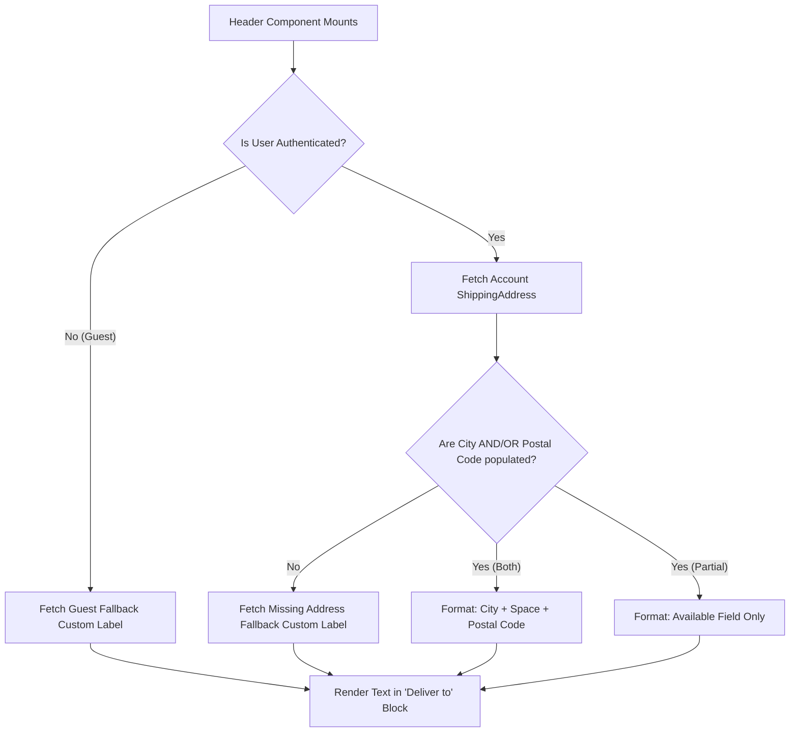

# Dynamic Delivery Location Header Component

**ID:** SPEC-001
**Version:** 1.0
**Status:** Draft
**Type:** Functional Specification

## Overview & Purpose
Currently, the B2B Commerce storefront global header contains a 'Deliver to' block that displays a static, hardcoded location (e.g., 'San Francisco 94105'). This creates a confusing experience for buyers outside that region and fails to reflect their actual account context. This specification defines the requirements to dynamically fetch the delivery location from the user's associated Account record in Salesforce. This ensures that when an agent or admin updates the account's address in the CRM, the storefront immediately reflects the correct shipping destination for the entitled buyer.

## Goals
- **OBJ-01:** Dynamically display the buyer's account shipping location in the global header.
  - *Measure:* 100% of logged-in users with a populated account shipping address see their specific city and postal code instead of the hardcoded fallback.

## Target Users
- **Entitled Buyer:** Authenticated users who need to verify that the storefront recognizes their correct delivery region for accurate catalog and pricing expectations.
- **Guest User:** Logged-out users browsing the storefront.

## Stakeholders
- **Entitled Buyer:** Needs to verify delivery region context. (Decision authority: None)
- **Salesforce Administrator / Agent:** Defines the source of truth for Account data; needs the storefront to accurately reflect the data maintained on the Account record without requiring code deployments. (Decision authority: High)

## Scope

### In Scope
- Dynamic retrieval of the user's Account Shipping City and Postal Code.
- Formatting and displaying the location in the global header's 'Deliver to' block.
- Fallback UI states for guest users and authenticated users missing address data.
- Integration with Salesforce Custom Labels for multi-language translation.
- CSS handling for long text truncation.

### Out of Scope
- Inline editing of the address directly from the header block.
- Building a modal or flyout menu to allow the user to select from multiple addresses or enter a new address.
- Using geolocation (IP or browser location) to guess the user's location.

## MoSCoW
None specified. (See Open Questions)

## Functional Requirements

- **FR-01: Data Retrieval & Business Rules**
  The system shall retrieve the Shipping City and Shipping Postal Code from the standard `ShippingAddress` compound field on the primary Account record associated with the authenticated user's Contact.
  - *Acceptance Criteria:*
    - **GIVEN** an authenticated user is linked to a Contact and Account **WHEN** the header component initializes **THEN** the system queries the standard `ShippingAddress` compound field for the City and PostalCode.

- **FR-02: Location Formatting**
  The system shall format the location display as '[City] [Postal Code]' on the second line of the 'Deliver to' component.
  - *Acceptance Criteria:*
    - **GIVEN** the system has successfully retrieved a City and Postal Code **WHEN** rendering the 'Deliver to' block **THEN** the second line displays the format "[City] [Postal Code]" separated by a single space.

- **FR-03: Localization via Custom Labels**
  The system shall source the 'Deliver to' prefix text and any fallback states from Salesforce Custom Labels to support multi-language translation.
  - *Acceptance Criteria:*
    - **GIVEN** the header component is rendering **WHEN** displaying static text (prefix or fallbacks) **THEN** the text is populated dynamically from Salesforce Custom Labels based on the user's locale.

- **FR-04: Secure Data Fetching**
  The system shall use standard Salesforce B2B Commerce wire adapters or Connect API to fetch the user's account details. If custom Apex is required, it must enforce Field-Level Security (FLS), CRUD permissions, and use the `with sharing` keyword.
  - *Acceptance Criteria:*
    - **GIVEN** the component requires backend data **WHEN** the data fetch executes **THEN** it respects the user's FLS and CRUD permissions and only returns data the user is authorized to see.

## User Stories

- **US-01:** As an Entitled Buyer, I want to view my delivery location in the global header, so that I can confirm that my orders will be routed to the correct default address associated with my account.
  - *Acceptance Criteria 1 (Happy Path):* **GIVEN** I am an authenticated buyer with a default Shipping Address on my Account **WHEN** I view the global header **THEN** the 'Deliver to' block displays my Account's Shipping City and Shipping Postal Code on the second line.
  - *Acceptance Criteria 2 (Missing Data):* **GIVEN** I am an authenticated buyer but my Account lacks a Shipping City or Postal Code **WHEN** I view the global header **THEN** the 'Deliver to' block displays a localized fallback message prompting me to update my address.
  - *Acceptance Criteria 3 (Guest User):* **GIVEN** I am a logged-out guest user **WHEN** I view the global header **THEN** the 'Deliver to' block displays a localized generic message such as 'Select Delivery Location'.

## Inputs/Outputs/Data Flow
- **Inputs:**
  - User Session Context (Authenticated vs. Guest)
  - User Locale (for Custom Labels)
  - Salesforce Account Record: `ShippingAddress.City`, `ShippingAddress.PostalCode`
- **Outputs:**
  - Rendered UI string in the global header (e.g., "San Francisco 94105" or localized fallback).
- **Data Flow:**
  1. LWC Header Component initializes.
  2. Component checks authentication state.
  3. If authenticated, component calls standard Wire Adapter / Connect API (or secure Apex) passing the user's context.
  4. Backend queries the Contact's primary Account `ShippingAddress`.
  5. Data is returned to the LWC, formatted, and rendered on screen.

## Flows

## Edge Cases & Error States

- **EC-01: Partial Address Data**
  - *Condition:* The Account has a Shipping City but no Postal Code (or vice versa).
  - *Expected Behavior:* Display the available field without trailing/leading spaces or orphaned commas. If neither is available, display the fallback Custom Label.
  - *Acceptance Criteria:* **GIVEN** an Account has only a City **WHEN** the header renders **THEN** only the City is displayed with no extra punctuation or spaces.

- **EC-02: Exceptionally Long City Name**
  - *Condition:* The Shipping City name exceeds the maximum width of the header block.
  - *Expected Behavior:* Truncate the text with an ellipsis (...) using CSS `text-overflow`, ensuring the layout does not break.
  - *Acceptance Criteria:* **GIVEN** a City name is wider than the UI container **WHEN** the component renders **THEN** the text is truncated with an ellipsis and the horizontal flex layout remains intact.

## Acceptance Criteria (Given/When/Then)
*(Acceptance criteria are documented inline within the Functional Requirements, User Stories, and Edge Cases sections above to ensure strict traceability per BA rules.)*

## Non-Functional Requirements

- **NFR-01 (Performance):** The dynamic address retrieval must not block the initial rendering of the global header.
  - *Target:* Address data resolves and renders within 300ms of the header component mounting.
- **NFR-02 (Accessibility):** The 'Deliver to' block must be accessible to screen readers.
  - *Target:* The component includes an `aria-label` describing its purpose and current value (e.g., 'Delivery location: San Francisco 94105').
- **NFR-03 (Usability):** The component layout must tolerate text expansion for localized strings and long city names.
  - *Target:* The UI container supports up to 30% text expansion without breaking the horizontal flex layout of the header.

## Assumptions
- **AD-02 (Assumption):** The 'Deliver to' block is currently a read-only display in this iteration, not an interactive button that opens a selection menu. *(Impact if wrong: Additional functional requirements and UI designs will be needed to handle the interaction, selection state, and session updates.)*

## Dependencies
- **AD-01 (Dependency):** Authenticated users are linked to a Contact, which is linked to an Account containing standard Shipping Address data. *(Impact if wrong: The component will fail to find the address and will always display the fallback state for logged-in users.)*

## Open Questions
- **OQ-01:** If an Account has multiple associated Contact Point Addresses (CPAs) instead of just the standard Account Shipping Address, should we query the default CPA instead? *(Recommended default: Use the standard Account.ShippingAddress for simplicity in this iteration, unless the org is strictly configured to use CPAs for B2B Commerce.)*
- **OQ-02:** What exact text should be displayed for logged-out (guest) users? *(Recommended default: Use a Custom Label with the default English text: 'Select Delivery Location'.)*
- **OQ-03:** Should the 'Deliver to' block be clickable to allow users to change their context in the future? *(Recommended default: Render it as a semantic button with appropriate focus states but attach no click handler yet, preparing it for future interactive scope.)*
- **OQ-04:** What is the MoSCoW prioritization for the requirements in this specification? (None specified in the provided documentation).

## Success Metrics
- **SM-01 (Leading):** Hardcoded location strings in the header component codebase.
  - *Target:* 0
  - *Data required:* Code review and static analysis of the LWC header component.