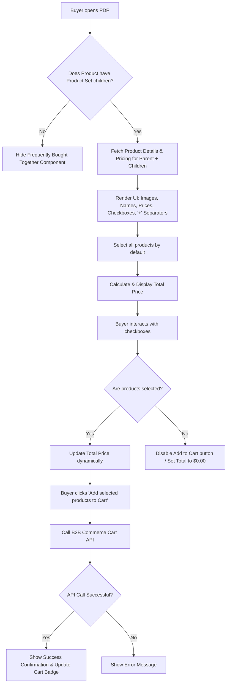

# Frequently Bought Together in PDP

**ID**: FBT-LWC-001
**Version**: 1.0
**Status**: Draft
**Type**: Functional Specification

## Overview & Purpose
Create a "Frequently Bought Together" Lightning Web Component (LWC) for the existing Salesforce B2B Commerce LWR Product Detail Page (PDP). This component allows buyers to view and purchase products configured in the current product's Product Set. It displays the current product (Set Parent) and its configured Set Components (child products) using an Amazon-style UI. Buyers can select or deselect products via checkboxes, view a dynamically calculated total price, and add all selected products to the cart in a single action using existing B2B Commerce functionality.

## Goals
* Reduce the number of steps required to add multiple configured Product Set products to the cart from the PDP to a single user action.

## Target Users
1. **B2B Buyers**: Primary users who browse the catalog, view product details, and add multiple related items to their cart efficiently.

## Stakeholders
None specified.

## Scope (In / Out)
**In Scope**:
* Frequently Bought Together LWC on the existing B2B Commerce PDP.
* Display the current PDP product and its configured Product Set child products.
* Checkbox selection and deselection for Product Set products.
* Dynamic total price calculation based on selected items.
* Add selected Product Set products to the existing Commerce cart.
* Responsive Amazon-style UI based on the provided design (images, names, prices, checkboxes, "+" separators).

**Out of Scope**:
* Modifying the existing PDP product details, pricing, inventory, or checkout functionality.
* Creating or modifying Salesforce Product Set relationships (assumes data is pre-configured).
* Generic Related Products or Product Recommendations.
* AI/ML-based product recommendations.
* Creating a new product data model or backend architecture.
* Modifying the existing PDP Add to Cart functionality.
* Creating unnecessary Apex Controllers, Services, Selectors, or other backend layers (must reuse standard APIs).

## MoSCoW
None specified.

## Functional Requirements
1. **Component Visibility**: Display the Frequently Bought Together section on the existing PDP only for products that have configured Product Set child products. Hide the section entirely if no child products are available.
2. **Data Retrieval**: Retrieve and display the current PDP product and its configured Product Set child products dynamically using the existing Salesforce B2B Commerce Product Set relationship and standard Commerce APIs. Do not hardcode products.
3. **UI Layout**: Display each product's image, name, and price. Include a "+" separator between products to mimic the Amazon-style design.
4. **Selection State**: Select the current PDP product and all available Product Set child products by default.
5. **User Interaction**: Allow buyers to select or deselect individual products (including the current PDP product and child products) using checkboxes.
6. **Dynamic Pricing**: Dynamically calculate and display the total price based on the sum of the currently selected products.
7. **Dynamic Button State**: Dynamically update the "Add selected products to Cart" button text/state based on the number of selected products.
8. **Cart Integration**: Add all selected products to the existing B2B Commerce cart when the Add to Cart button is clicked, triggering standard cart update events.

## User Stories

**US1: View Frequently Bought Together Section**
*As a B2B Buyer, I want to see a Frequently Bought Together section on the PDP, so that I can easily discover and buy related items configured as a set.*
* **Given** I navigate to a PDP for a product that has a configured Product Set
* **When** the page loads
* **Then** I see the Frequently Bought Together section displaying the current product and its child products with images, names, prices, and "+" separators.

**US2: Default Selection and Toggling**
*As a B2B Buyer, I want all items in the set to be selected by default but allow me to deselect them, so that I have control over exactly what I am purchasing.*
* **Given** the Frequently Bought Together section is visible
* **When** I view the checkboxes next to each product
* **Then** all checkboxes are checked by default
* **When** I click a checkbox
* **Then** the product is toggled (deselected/selected).

**US3: Dynamic Total Price**
*As a B2B Buyer, I want to see the total price update automatically when I select or deselect items, so that I know exactly how much the bundle will cost.*
* **Given** the Frequently Bought Together section is visible with a calculated total price
* **When** I deselect a product
* **Then** the total price decreases by the price of the deselected product
* **When** I re-select the product
* **Then** the total price increases by the price of the selected product.

**US4: Add to Cart Action**
*As a B2B Buyer, I want to click a single button to add all selected items to my cart, so that I save time compared to adding them individually.*
* **Given** I have one or more products selected in the Frequently Bought Together section
* **When** I click "Add selected products to Cart"
* **Then** all selected products are added to my B2B Commerce cart
* **And** I receive a success confirmation
* **And** the global cart badge updates to reflect the new items.

## Inputs, Outputs & Data Flow
**Inputs**:
* Current PDP Product ID.
* Existing Product Set child/component products for the current PDP product.
* Current buyer/store context (WebStore ID, Account ID) for product visibility and pricing.
* Product details (image URL, name, price, product ID).
* User checkbox selections and deselections.

**Outputs**:
* Rendered Frequently Bought Together UI section.
* Selected/deselected product state in the browser memory.
* Dynamically calculated total price (Currency).
* Dynamic Add to Cart button state/text.
* Cart update payload (Array of Product IDs and Quantities).
* Success or error toast/feedback after the Add to Cart action.

**Data Entities / Models Touched**:
* `Product2` (Read)
* `ProductSet` (Read)
* `ProductSetItem` (Read)
* `WebStore` (Read - Context)
* `WebCart` (Update via API)
* `CartItem` (Create via API)

## Flows

## Edge Cases & Error States
1. **No Product Set Configured**: If the current PDP product is not a Set Parent or has no active Set Components, the component must render nothing (collapse gracefully) to avoid disrupting the PDP layout.
2. **Out of Stock Child Products**: If a child product in the Product Set is out of stock or unavailable to the current buyer's entitlement policy, it should either be excluded from the UI or displayed as disabled/out-of-stock (depending on standard B2B API response).
3. **Zero Products Selected**: If the user deselects all checkboxes, the total price must read $0.00, and the "Add selected products to Cart" button must be disabled to prevent empty API calls.
4. **Pricing API Failure**: If the standard pricing API fails to return a price for one or more items, display a fallback error state within the component rather than a $0.00 price.
5. **Partial Add to Cart Failure**: If adding multiple items to the cart results in a partial failure (e.g., one item succeeds, another fails due to limits), display a clear error toast indicating which items failed.
6. **Network Disconnection**: If the user loses internet connection when clicking "Add to Cart", catch the timeout/error and display a standard offline error toast.

## Acceptance Criteria

**Given** the user is on a PDP for a product with a Product Set
**When** the component initializes
**Then** it must query the Product Set items using standard B2B APIs
**And** display the parent product and child products in a row with "+" separators.

**Given** the Frequently Bought Together component is rendered
**When** the user views the component
**Then** all checkboxes must be checked by default
**And** the total price must equal the sum of all displayed products' prices.

**Given** the user interacts with the checkboxes
**When** a checkbox is unchecked
**Then** the total price must immediately recalculate to exclude that product's price
**And** the "Add to Cart" button text must reflect the current number of selected items (e.g., "Add 2 items to Cart").

**Given** the user has selected items
**When** the user clicks the "Add to Cart" button
**Then** the component must invoke the standard B2B Commerce Add to Cart API (e.g., `ConnectApi.CommerceCart.addItemsToCart`)
**And** upon success, display a success toast message
**And** fire the standard Lightning Message Service (LMS) event to update the cart badge.

**Given** the user is on a PDP for a product without a Product Set
**When** the component initializes
**Then** it must remain hidden and occupy zero vertical space on the page.

## Non-Functional Requirements
1. **Performance**: The component must load product and pricing data asynchronously to avoid blocking the main PDP rendering.
2. **Platform Standards**: Must be built as a Lightning Web Component (LWC) for the Salesforce LWR (Lightning Web Runtime) framework.
3. **Responsiveness**: The Amazon-style horizontal layout must wrap gracefully on mobile and tablet devices, converting the "+" separators into a stacked or grid layout as appropriate for smaller screens.
4. **Accessibility (WCAG)**: Checkboxes must have appropriate `aria-labels` linking them to the product names. Total price updates must be announced to screen readers using `aria-live`.
5. **Code Quality**: Must strictly avoid custom Apex unless standard Wire Adapters/ConnectApi cannot retrieve Product Set items in LWR. If Apex is required, it must be bulkified, enforce sharing/FLS, and be cacheable where appropriate.

## Assumptions
1. Standard Salesforce B2B Commerce APIs (e.g., `ConnectApi`) support retrieving Product Set items and adding multiple items to the cart simultaneously.
2. If standard LWC wire adapters do not support fetching Product Sets directly, a minimal, reusable Apex controller wrapping `ConnectApi` will be used, adhering to the requirement to avoid *unnecessary* backend files.
3. The buyer has the necessary entitlements to view and purchase the child products configured in the Product Set.
4. The existing PDP Add to Cart functionality uses standard Lightning Message Service (LMS) or standard LWR events to update the cart badge, which this new component can also publish to.
5. All products in the Product Set are simple products (no complex variations or attributes required to be selected before adding to cart).

## Dependencies
1. Salesforce B2B Commerce LWR template and framework.
2. Standard `ConnectApi` for Commerce (Catalog, Pricing, and Cart).
3. Existing Cart component (for listening to cart update events).
4. Pre-configured Product Set data in the Salesforce org.

## Open Questions
1. **Stakeholders**: Who are the primary stakeholders and decision authorities for this feature? (None specified).
2. **MoSCoW Prioritization**: What is the priority of this feature compared to other PDP enhancements? (None specified).
3. **Out of Stock Behavior**: Should out-of-stock child products be completely hidden from the component, or shown but disabled?
4. **Quantity Rules**: Are there any minimum or maximum quantity rules for the child products, or is the quantity always assumed to be 1 for each selected item?
5. **Variations**: How should the component handle child products that are variation parents requiring attribute selection (e.g., size, color)? (Assumption #5 currently assumes simple products).

## Success Metrics
1. **Usage Rate**: Percentage of PDP visits (where Product Sets exist) that result in a click on the "Add selected products to Cart" button.
2. **Average Order Value (AOV)**: Increase in AOV for orders containing products that have configured Product Sets.
3. **Items Per Cart**: Increase in the average number of line items per cart.