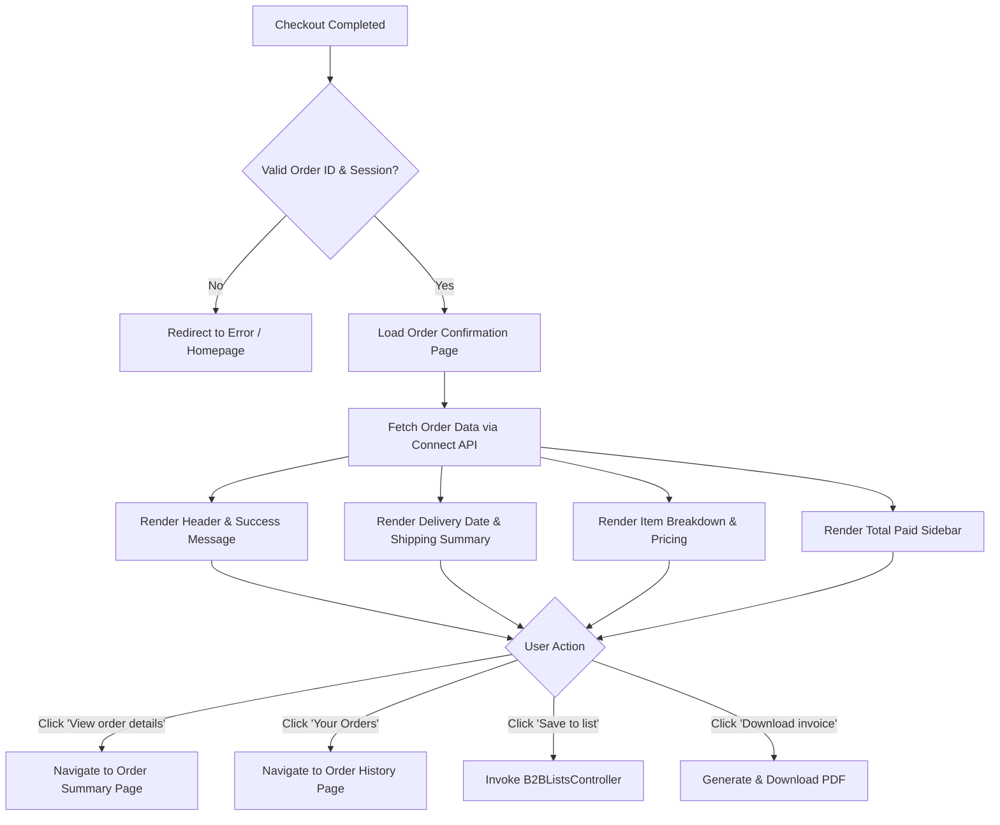

---
**Title:** Order Confirmation Page Redesign
**ID:** FRS-B2B-ORD-CONF-001
**Version:** 1.0
**Status:** Proposed
**Type:** Functional Specification
---

## Overview & Purpose
The existing Order Confirmation page in the Salesforce B2B Commerce store displays full billing and shipping details, which clutters the interface and causes UI bugs such as truncated addresses and wrapped email text. To align with the Amazon Business experience, the page is being redesigned to focus on delivery dates and immediate next steps, moving the full receipt details to the Order Details page. This change provides entitled buyers with a clearer, more reassuring post-purchase experience while adhering to strict multi-currency and localization constraints.

## Goals
*   **OBJ-01:** Improve post-purchase clarity by focusing on delivery expectations rather than billing data (measured by a decrease in customer support inquiries related to order confirmation confusion).
*   **OBJ-02:** Streamline page layout and eliminate existing UI bugs (measured by zero reported UI truncation or text-wrapping bugs on the confirmation page post-launch).

## Target Users
*   **Entitled Buyer:** The primary end-user who has successfully placed an order and needs immediate reassurance, delivery timelines, and reference numbers (e.g., unmasked Purchase Order number) for internal records.

## Stakeholders
*   **Entitled Buyer:** 
    *   *Decision authority:* None
    *   *Concerns:* Knowing the order was placed successfully; knowing when the order will arrive; accessing the unmasked Purchase Order number for internal records.
*   **B2B Store Administrator:** 
    *   *Decision authority:* Approves final UI and functional implementation.
    *   *Concerns:* Maintaining standard Salesforce B2B functionality; ensuring multi-currency and localization compliance.

## Scope
**In Scope:**
*   Redesigned confirmation header with success messaging.
*   Prominent delivery date and simplified shipping summary.
*   Display of unmasked Purchase Order (PO) number alongside the Order Number.
*   Detailed item breakdown including quantities, unit prices, struck-through original prices, and line totals.
*   Total Paid sidebar featuring tax lines (even if zero), promotion chips, and savings summaries.
*   Navigation actions: View order details, Your Orders, Save order to a list, Download invoice (PDF).
*   Plain text rendering of all address data to prevent hyperlink UI bugs.

**Out of Scope:**
*   Displaying order approval notices or approval status on the confirmation page.
*   Displaying the full shipping address block.
*   Displaying the Billing Details section (billing address, masked email).

## MoSCoW
None specified.

## Functional Requirements

*   **FR-01: Success Header**
    *   The system shall display a compact green checkmark and the text 'Order placed, thank you!' and 'A confirmation will be sent to your email.' in the header.
    *   *Acceptance Criteria:* GIVEN a successfully placed order, WHEN the confirmation page loads, THEN the header displays a green checkmark, the exact success text, and the email confirmation notice.
*   **FR-02: Order and PO Numbers**
    *   The system shall display the Order Number and the full, unmasked Purchase Order number side by side.
    *   *Acceptance Criteria:* GIVEN an order placed with a PO number, WHEN the page renders, THEN the Order Number and unmasked PO number are displayed adjacently.
*   **FR-03: Delivery Date Display**
    *   The system shall display the delivery date as the largest text below the header, formatted as 'Arriving [date]'.
    *   *Acceptance Criteria:* GIVEN an order with a delivery date, WHEN the delivery section renders, THEN 'Arriving [date]' is the largest typography in that section.
*   **FR-04: Shipping Summary**
    *   The system shall display a single-line shipping summary formatted as '[Shipping method] · Shipping to [Name], [City, State]'.
    *   *Acceptance Criteria:* GIVEN an order with shipping details, WHEN the delivery section renders, THEN the shipping summary appears on a single line matching the specified format.
*   **FR-05: Item Quantities**
    *   The system shall display item quantities with the label 'Qty: [X]'.
    *   *Acceptance Criteria:* GIVEN an order with multiple items, WHEN the item list renders, THEN each item displays its quantity formatted as 'Qty: [X]'.
*   **FR-06: Item Pricing Breakdown**
    *   The system shall display the unit price, the struck-through original unit price (if applicable), and the line total for each item.
    *   *Acceptance Criteria:* GIVEN an item with a discount, WHEN the item renders, THEN the current unit price, a struck-through original price, and the total line price are displayed using the active currency.
*   **FR-07: Order Details Navigation**
    *   The system shall provide a primary 'View order details' button linking to the Order Summary page for the current order.
    *   *Acceptance Criteria:* GIVEN the confirmation page, WHEN the user clicks 'View order details', THEN they are routed to the detailed Order Summary page for that specific order ID.
*   **FR-08: Order History Navigation**
    *   The system shall provide a 'Your Orders' link navigating to the Order History page.
    *   *Acceptance Criteria:* GIVEN the confirmation page, WHEN the user clicks 'Your Orders', THEN they are routed to the account's Order History page.
*   **FR-09: Total Paid Sidebar**
    *   The system shall display a Total Paid sidebar including a Tax line, promotion chips, and a 'You saved $X on this order' summary.
    *   *Acceptance Criteria:* GIVEN an order with applied promotions and taxes, WHEN the sidebar renders, THEN it displays the Tax line, promotion chips, and the total savings string.
*   **FR-10: Save to List Action**
    *   The system shall provide a 'Save order to a list' action utilizing the existing B2BListsController.
    *   *Acceptance Criteria:* GIVEN the confirmation page, WHEN the user clicks 'Save order to a list', THEN the B2BListsController is invoked and the items are saved to a list.
*   **FR-11: Download Invoice Action**
    *   The system shall provide a 'Download invoice (PDF)' action in the sidebar.
    *   *Acceptance Criteria:* GIVEN the confirmation page, WHEN the user clicks 'Download invoice (PDF)', THEN a PDF version of the invoice is generated and downloaded.
*   **FR-12: Plain Text Addresses**
    *   The system shall ensure addresses are rendered as plain text, not hyperlinks.
    *   *Acceptance Criteria:* GIVEN any address string on the page, WHEN rendered in the browser, THEN it is not wrapped in an anchor `<a>` tag and is not clickable.

## User Stories

*   **US-01:** As an Entitled Buyer, I want to view a clear confirmation header and delivery summary, so that I know my order was placed successfully and when to expect it.
    *   *Given* an order is successfully placed, *When* the buyer is redirected to the Order Confirmation page, *Then* a compact green check with 'Order placed, thank you!' and an email confirmation notice is displayed in the header.
    *   *Given* the order has a delivery date and shipping details, *When* the delivery section is rendered, *Then* 'Arriving [date]' is prominently displayed as the largest text, followed by a single line showing '[Shipping method] · Shipping to [Name], [City, State]'.
    *   *Given* the order confirmation page is displayed, *When* the user views any address information, *Then* the address is rendered as plain text and not as a clickable link.
*   **US-02:** As an Entitled Buyer, I want to view my unmasked Purchase Order number alongside the Order Number, so that I can easily reference it for my internal records.
    *   *Given* an order was placed with a PO number, *When* the order references are displayed, *Then* the full, unmasked PO number is shown side by side with the Order Number.
*   **US-03:** As an Entitled Buyer, I want to view a detailed breakdown of my items, savings, and taxes, so that I can verify the financial details of my purchase.
    *   *Given* an order with items is displayed, *When* the items list is rendered, *Then* each item shows 'Qty: [X]', the unit price, the struck-through original price (if applicable), and the line total.
    *   *Given* the Total Paid sidebar is rendered, *When* the financial summary is calculated, *Then* it includes a Tax line (even if $0.00), a 'You saved $X on this order' message, and promotion chips.
    *   *Given* the order confirmation page is loaded, *When* the financial totals are displayed, *Then* the product, quantity, pricing, tax, and total are displayed correctly using the active currency, and the lines add up to the total.
*   **US-04:** As an Entitled Buyer, I want to navigate to my order details, order history, or save the order to a list, so that I can manage my purchases efficiently.
    *   *Given* the Order Confirmation page is displayed, *When* the buyer clicks 'View order details', *Then* they are navigated to the Order Summary page for this specific order.
    *   *Given* the Order Confirmation page is displayed, *When* the buyer clicks 'Your Orders', *Then* they are navigated to the Order History page where the new order appears.
    *   *Given* the Order Confirmation page is displayed, *When* the buyer clicks 'Save order to a list', *Then* the order items are saved using the existing Saved Lists feature.

## Inputs/Outputs/Data Flow
*   **Inputs:**
    *   Order ID (passed via URL or session context upon checkout completion).
    *   User Session / Authentication Token (to verify entitlement).
    *   Active Currency Context (from Salesforce B2B Commerce settings).
*   **Outputs:**
    *   Rendered Order Confirmation UI.
    *   PDF Invoice file (upon user request).
    *   Saved List record (upon user request).
*   **Data Flow:**
    *   Checkout process completes -> Redirects to Order Confirmation Page with Order ID.
    *   Standard commerce wire adapters / Connect API fetch Order Summary, Order Items, Pricing, and Promotions using the Order ID.
    *   Data is passed to Lightning Web Components (LWC) for rendering.
    *   Currency values are formatted via `lightning-formatted-number` based on the active currency context.

## Flows

## Edge Cases & Error States

*   **EC-01: Missing Purchase Order Number**
    *   *Given* an order was placed without a Purchase Order number, *When* the order references section is rendered, *Then* the PO number field is gracefully hidden without leaving empty labels or broken formatting next to the Order Number.
*   **EC-02: No Savings / Discounts**
    *   *Given* an order has no promotions or discounts applied, *When* the Total Paid sidebar is rendered, *Then* the 'You saved $X on this order' text is completely hidden.
*   **EC-03: Unauthorized Access Attempt**
    *   *Given* a buyer attempts to access an order confirmation page via URL manipulation, *When* the order belongs to another account, *Then* the system denies access and redirects the user to an error page or the homepage.
*   **EC-04: Page Refresh or Back Button Navigation**
    *   *Given* a user is on the Order Confirmation page, *When* they refresh the page or navigate to it via the browser's Back button, *Then* the page reloads the existing order details without creating a duplicate order or triggering a new charge.
*   **EC-05: Zero Tax Order**
    *   *Given* an order is tax-exempt or incurs no tax, *When* the Total Paid sidebar is rendered, *Then* the Tax line is still displayed, showing a value of $0.00 in the active currency.

## Acceptance Criteria (Given/When/Then)
*(Note: Specific functional acceptance criteria are detailed inline within the Functional Requirements, User Stories, and Edge Cases sections above. The following represent global page-level criteria.)*

*   *Given* the Order Confirmation page is loaded, *When* the user resizes the viewport to under 768px, *Then* the Total Paid sidebar moves below the main order content and all action buttons become full-width.
*   *Given* the Order Confirmation page is loaded in a localized language, *When* text expands up to 30%, *Then* the layout remains intact without overlapping or truncating text.
*   *Given* a user relies on assistive technologies, *When* they navigate the Order Confirmation page, *Then* all semantic landmarks, keyboard operability, visible focus states, and `aria-live` regions on dynamic content function with 100% compliance to accessibility standards.
*   *Given* monetary values are displayed on the page, *When* rendered, *Then* they are formatted using `lightning-formatted-number` bound to the active currency, with no hardcoded currency symbols.

## Non-Functional Requirements
*   **NFR-01 (Usability/Localization):** The layout must tolerate text expansion to accommodate localization. Target: Layout remains intact with up to 30% text expansion.
*   **NFR-02 (Security):** Order information must only be accessible to the buyer/account that placed the order. Target: 100% prevention of unauthorized access via URL manipulation.
*   **NFR-03 (Usability/Mobile):** The page must be responsive on mobile devices. Target: Sidebar moves below the order content and buttons become full-width on viewports under 768px.
*   **NFR-04 (Accessibility):** The page must comply with strict accessibility standards. Target: 100% compliance with semantic landmarks, keyboard operability, visible focus states, and aria-live on dynamic regions.
*   **BR-03 (Formatting):** Money formats must use `lightning-formatted-number` bound to the active currency. Hardcoded currency symbols are prohibited.

## Assumptions
*   **AD-03:** All user-facing strings will be sourced from Custom Labels or translated store content to meet multi-language localization requirements.
*   The underlying platform is Salesforce B2B Commerce (Lightning Web Components), and standard UI components (like `lightning-formatted-number`) are available and preferred.

## Dependencies
*   **AD-01:** The 'Save order to a list' functionality depends on the existing `B2BListsController`. If unavailable or incompatible, the action will fail or require custom Apex development.
*   **AD-02:** Standard commerce wire adapters and Connect API provide the necessary data (original price, savings, tax) to the confirmation page. If they do not expose this data, custom Apex controllers will need to be built.

## Open Questions
*   **OQ-01:** How should multiple shipments with different delivery dates be displayed on the confirmation page? *(Recommended default: Group items by shipment and display the 'Arriving [date]' and shipping summary for each shipment block.)*
*   **OQ-02:** How is the 'Download invoice (PDF)' generated and retrieved? *(Recommended default: Use standard Salesforce B2B Commerce invoice PDF generation if available; otherwise, link to a custom Visualforce PDF page rendered from the Order Summary.)*
*   **OQ-03:** What is the MoSCoW prioritization for the requirements listed in this specification? (None specified in the initial brief).

## Success Metrics
*   **SM-01 (Leading):** UI truncation and wrapping bugs. Target: 0 bugs reported during QA and UAT for the confirmation page. (Data required: QA defect logs).
*   **SM-02 (Lagging):** Click-through rate to Order Details. Target: Increase in users clicking 'View order details' to view full receipt. (Data required: Storefront analytics and click tracking).