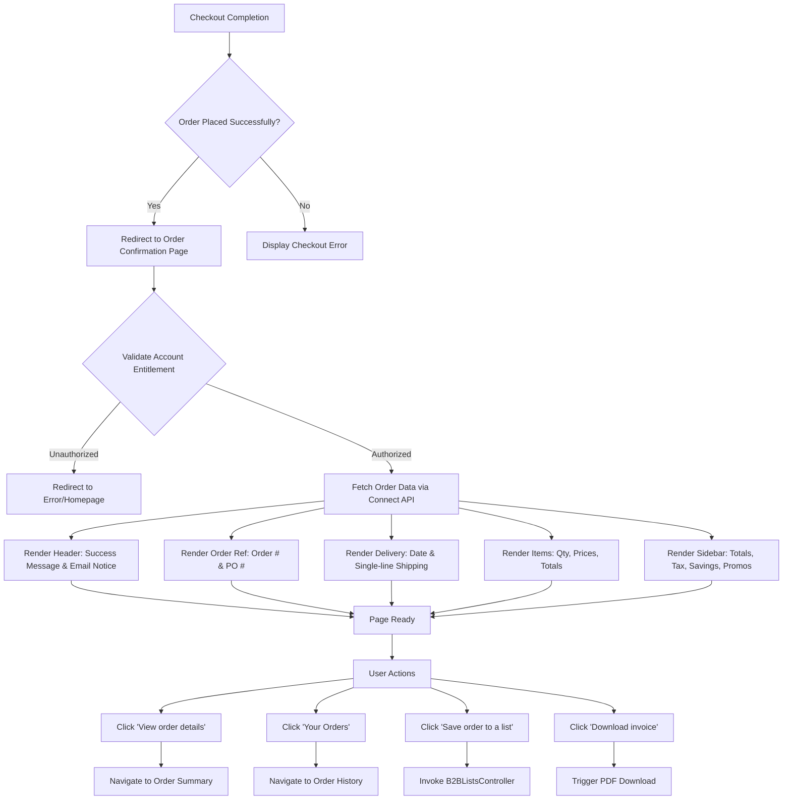

# Order Confirmation Page Redesign (Salesforce B2B Commerce)

**Document ID**: SPEC-ORD-CONF-001
**Version**: 1.0
**Status**: Draft
**Type**: Functional Specification

## Overview & Purpose
The existing Order Confirmation page in the Salesforce B2B Commerce store displays full billing and shipping details, which clutters the interface and causes UI bugs such as truncated addresses and wrapped email text. To align with the Amazon Business experience, the page is being redesigned to focus on delivery dates and immediate next steps, moving the full receipt details to the Order Details page. This change provides entitled buyers with a clearer, more reassuring post-purchase experience while adhering to strict multi-currency and localization constraints.

## Goals
*   **OBJ-01**: Improve post-purchase clarity by focusing on delivery expectations rather than billing data.
*   **OBJ-02**: Streamline page layout and eliminate existing UI bugs (truncation and text-wrapping).

## Target Users
*   **Entitled Buyer**: The primary end-user who has successfully placed an order and needs immediate confirmation, delivery expectations, and access to internal reference numbers (PO number).

## Stakeholders
*   **Entitled Buyer**:
    *   *Decision authority*: None
    *   *Concerns*: Knowing the order was placed successfully; Knowing when the order will arrive; Accessing the unmasked Purchase Order number for internal records.
*   **B2B Store Administrator**:
    *   *Decision authority*: Approves final UI and functional implementation.
    *   *Concerns*: Maintaining standard Salesforce B2B functionality; Ensuring multi-currency and localization compliance.

## Scope

### In Scope
*   Redesign of the Order Confirmation page header to display a success message and email notice.
*   Display of unmasked Purchase Order number alongside the Order Number.
*   Prominent display of delivery dates and a single-line shipping summary.
*   Detailed item breakdown including quantities, unit prices, struck-through original prices, and line totals.
*   Total Paid sidebar featuring tax lines, savings summaries, and promotion chips.
*   Navigation links to Order Details, Order History, and "Save order to a list" functionality.
*   "Download invoice (PDF)" functionality.
*   Rendering addresses as plain text to prevent UI bugs.

### Out of Scope
*   Displaying order approval notices or approval status on the confirmation page.
*   Displaying the full shipping address block.
*   Displaying the Billing Details section (billing address, masked email).

## MoSCoW
None specified.

## Functional Requirements

*   **FR-01**: The system shall display a compact green checkmark and the text 'Order placed, thank you!' and 'A confirmation will be sent to your email.' in the header.
*   **FR-02**: The system shall display the Order Number and the full, unmasked Purchase Order number side by side.
*   **FR-03**: The system shall display the delivery date as the largest text below the header, formatted as 'Arriving [date]'.
*   **FR-04**: The system shall display a single-line shipping summary formatted as '[Shipping method] · Shipping to [Name], [City, State]'.
*   **FR-05**: The system shall display item quantities with the label 'Qty: [X]'.
*   **FR-06**: The system shall display the unit price, the struck-through original unit price (if applicable), and the line total for each item.
*   **FR-07**: The system shall provide a primary 'View order details' button linking to the Order Summary page for the current order.
*   **FR-08**: The system shall provide a 'Your Orders' link navigating to the Order History page.
*   **FR-09**: The system shall display a Total Paid sidebar including a Tax line (even if $0.00), promotion chips, and a 'You saved $X on this order' summary.
*   **FR-10**: The system shall provide a 'Save order to a list' action utilizing the existing `B2BListsController`.
*   **FR-11**: The system shall provide a 'Download invoice (PDF)' action in the sidebar.
*   **FR-12**: The system shall ensure addresses are rendered as plain text, not hyperlinks.

## User Stories

*   **US-01**: As an Entitled Buyer, I want to view a clear confirmation header and delivery summary, so that I know my order was placed successfully and when to expect it.
*   **US-02**: As an Entitled Buyer, I want to view my unmasked Purchase Order number alongside the Order Number, so that I can easily reference it for my internal records.
*   **US-03**: As an Entitled Buyer, I want to view a detailed breakdown of my items, savings, and taxes, so that I can verify the financial details of my purchase.
*   **US-04**: As an Entitled Buyer, I want to navigate to my order details, order history, or save the order to a list, so that I can manage my purchases efficiently.

## Inputs/Outputs/Data Flow

*   **Inputs**:
    *   Order ID (passed via URL or session context post-checkout).
    *   Active User Session (to validate entitlement and account ownership).
    *   Active Currency (from user/store locale settings).
*   **Outputs**:
    *   Order Summary Data (retrieved via standard commerce wire adapters and Connect API).
    *   Saved List Entry (payload sent to `B2BListsController` when saving order to a list).
    *   Invoice PDF (generated or retrieved for download).

## Flows

## Edge Cases & Error States

*   **EC-01 (Missing PO Number)**: If the order was placed without a Purchase Order number, the system must hide the PO number field gracefully without leaving empty labels or broken formatting next to the Order Number.
*   **EC-02 (No Savings/Promotions)**: If the order has no savings (no promotions or discounts applied), the 'You saved $X on this order' text must be hidden from the Total Paid sidebar.
*   **EC-03 (Unauthorized Access)**: If a buyer attempts to access an order confirmation page for an order belonging to another account, the system must deny access and redirect the user to an error page or the homepage.
*   **EC-04 (Duplicate Order Prevention)**: Refreshing the Order Confirmation page or navigating to it via the browser's Back button must not create a duplicate order.

## Acceptance Criteria

**Header & Delivery Summary (US-01)**
*   **Given** an order is successfully placed **When** the buyer is redirected to the Order Confirmation page **Then** a compact green check with 'Order placed, thank you!' and an email confirmation notice is displayed in the header.
*   **Given** the order has a delivery date and shipping details **When** the delivery section is rendered **Then** 'Arriving [date]' is prominently displayed as the largest text, followed by a single line showing '[Shipping method] · Shipping to [Name], [City, State]'.
*   **Given** the order confirmation page is displayed **When** the user views any address information **Then** the address is rendered as plain text and not as a clickable link.

**Order References (US-02)**
*   **Given** an order was placed with a PO number **When** the order references are displayed **Then** the full, unmasked PO number is shown side by side with the Order Number.

**Financial Breakdown & Sidebar (US-03)**
*   **Given** an order with items is displayed **When** the items list is rendered **Then** each item shows 'Qty: [X]', the unit price, the struck-through original price (if applicable), and the line total.
*   **Given** the Total Paid sidebar is rendered **When** the financial summary is calculated **Then** it includes a Tax line (even if $0.00), a 'You saved $X on this order' message, and promotion chips.
*   **Given** the order confirmation page is loaded **When** the financial totals are displayed **Then** the product, quantity, pricing, tax, and total are displayed correctly using the active currency, and the lines add up to the total.

**Navigation & Actions (US-04)**
*   **Given** the Order Confirmation page is displayed **When** the buyer clicks 'View order details' **Then** they are navigated to the Order Summary page for this specific order.
*   **Given** the Order Confirmation page is displayed **When** the buyer clicks 'Your Orders' **Then** they are navigated to the Order History page where the new order appears.
*   **Given** the Order Confirmation page is displayed **When** the buyer clicks 'Save order to a list' **Then** the order items are saved using the existing Saved Lists feature.

## Non-Functional Requirements

*   **NFR-01 (Usability/Localization)**: The layout must tolerate text expansion to accommodate localization. Target: Layout remains intact with up to 30% text expansion.
*   **NFR-02 (Security)**: Order information must only be accessible to the buyer/account that placed the order. Target: 100% prevention of unauthorized access via URL manipulation.
*   **NFR-03 (Usability/Mobile)**: The page must be responsive on mobile devices. Target: Sidebar moves below the order content and buttons become full-width on viewports under 768px.
*   **NFR-04 (Accessibility)**: The page must comply with strict accessibility standards. Target: 100% compliance with semantic landmarks, keyboard operability, visible focus states, and aria-live on dynamic regions.
*   **NFR-05 (Formatting)**: Money formats must use `lightning-formatted-number` bound to the active currency. Hardcoded currency symbols are prohibited.

## Assumptions

*   **AD-03**: All user-facing strings will be sourced from Custom Labels or translated store content. (Impact if wrong: The page will fail multi-language localization requirements).

## Dependencies

*   **AD-01**: The 'Save order to a list' functionality depends on the existing `B2BListsController`. (Impact if wrong: The save to list action will fail or require custom Apex development).
*   **AD-02**: Standard commerce wire adapters and Connect API provide the necessary data (original price, savings, tax) to the confirmation page. (Impact if wrong: Custom Apex controllers will need to be built, violating the preference for standard adapters).

## Open Questions

*   **OQ-01**: How should multiple shipments with different delivery dates be displayed on the confirmation page? *(Recommended default: Group items by shipment and display the 'Arriving [date]' and shipping summary for each shipment block).*
*   **OQ-02**: How is the 'Download invoice (PDF)' generated and retrieved? *(Recommended default: Use standard Salesforce B2B Commerce invoice PDF generation if available; otherwise, link to a custom Visualforce PDF page rendered from the Order Summary).*
*   **OQ-03**: What are the MoSCoW priorities for the listed functional requirements? (None specified in the provided documentation).

## Success Metrics

*   **SM-01 (Leading)**: UI truncation and wrapping bugs. Target: 0 bugs reported during QA and UAT for the confirmation page. (Data required: QA defect logs).
*   **SM-02 (Lagging)**: Click-through rate to Order Details. Target: Increase in users clicking 'View order details' to view full receipt. (Data required: Storefront analytics and click tracking).