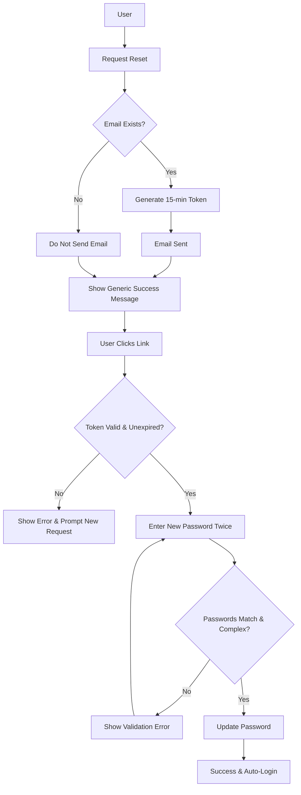

# Password Reset Feature
**ID:** PR-001
**Version:** 1.0
**Status:** Draft
**Type:** Functional Specification

## Overview & Purpose
The purpose of this feature is to provide a secure mechanism for users to regain access to their accounts by resetting their passwords via an email verification link.

## Goals
* Allow users to securely reset their password via an email link.

## Target Users
* **Registered Customers:** End-users who need to regain access to their accounts.
* **Customer Support:** Internal staff who can trigger a password reset on behalf of a customer.

## Stakeholders
None specified.

## Scope (In / Out)
**In Scope:**
* Requesting a password reset.
* Email delivery of the reset link.
* Setting a new password.

**Out of Scope:**
* SMS-based password reset.
* Social login password reset.

## MoSCoW
None specified.

## Functional Requirements
* **REQ-1: Password Reset Request:** The system shall allow a user to submit an email address to request a password reset.
* **REQ-2: Account Validation & Security:** The system shall validate if the submitted email exists in the database without exposing this information to the frontend.
* **REQ-3: Email Delivery:** The system shall generate and send an email containing a secure password reset link. The link must automatically expire after exactly 15 minutes.
* **REQ-4: Password Update Interface:** The system shall provide an interface for the user to enter a new password and confirm it by entering it a second time.
* **REQ-5: Password Complexity:** The system shall enforce the following password complexity rules: minimum of 8 characters, at least 1 number, and at least 1 special character.
* **REQ-6: Completion & Authentication:** Upon successful password update, the system shall save the new password and automatically log the user into their account.

## User Stories

**As a Registered Customer, I want to request a password reset link via my email so that I can regain access to my account.**
* **Given** I am on the password reset request page
* **When** I enter my email address and submit the form
* **Then** the system should process the request and display a generic success message regardless of whether the email exists.

**As a Customer Support Agent, I want to trigger a password reset for a specific customer so that I can assist users who are unable to do it themselves.**
* **Given** I am authenticated as a Customer Support user
* **When** I trigger a password reset for a customer's account
* **Then** the system should generate and send the 15-minute expiring reset email to that customer's registered email address.

**As a Registered Customer, I want to set a new password using a secure link so that I can securely log into my account.**
* **Given** I have clicked a valid, unexpired password reset link from my email
* **When** I enter a new password that meets complexity requirements and matching confirmation password
* **Then** the system should update my password and automatically log me into the application.

## Inputs/Outputs/Data Flow
**Inputs:**
* Email Address (String, standard email format)
* Reset Token (String/UUID, extracted from the email link)
* New Password (Secure String)
* Password Confirmation (Secure String)

**Outputs:**
* Password Reset Email (SMTP payload containing the reset URL)
* UI Messages (Generic success message, validation errors, expiration errors)
* Updated User Record (Modified password hash in the database)
* Session Token/Cookie (Generated upon automatic login)

**Data Flow:**
1. Client submits Email to Server.
2. Server validates Email. If valid, generates a 15-minute Token and stores it.
3. Server dispatches Email with Token URL via Email Provider.
4. User clicks URL; Client extracts Token and presents the New Password form.
5. Client submits Token, New Password, and Password Confirmation to Server.
6. Server validates Token (existence and expiry) and Password (complexity and match).
7. Server hashes New Password, updates Database, invalidates Token, and returns an active Session to Client.

## Flows

## Edge Cases & Error States
* **Email Not Found:** If an unregistered email is submitted, the system must show the exact same generic success message as a valid request to prevent email enumeration attacks.
* **Link Expired:** If the user clicks a reset link older than 15 minutes, the system must deny the reset, display an error message, and provide a prompt/button to request a new link.
* **Passwords Don't Match:** If the "New Password" and "Confirm Password" fields do not match, the system must prevent submission and display an inline error message.
* **Weak Password:** If the entered password fails the complexity requirements (8+ chars, 1 number, 1 special char), the system must reject the input and display an error detailing the missing requirements.

## Acceptance Criteria (Given/When/Then)
* **Given** a user submits an email address for a password reset, **When** the system processes the request, **Then** it must display a generic success message ("If an account exists, an email has been sent") regardless of database presence.
* **Given** a user receives a password reset email, **When** 15 minutes have passed since the email was generated, **Then** the link must be strictly invalidated by the server.
* **Given** a user is on the password reset form, **When** they submit a password lacking a number or special character, **Then** the system must reject the update and display a complexity error.
* **Given** a user is on the password reset form, **When** they submit a password less than 8 characters long, **Then** the system must reject the update and display a length error.
* **Given** a user successfully updates their password, **When** the database update completes, **Then** the system must immediately issue an authenticated session and redirect the user to the logged-in state.

## Non-Functional Requirements
* **Security:** The system must prevent user enumeration by standardizing the response time and UI messaging for both valid and invalid email submissions.
* **Security:** Reset tokens must be cryptographically secure, single-use, and strictly time-bound to 15 minutes.

## Assumptions
* The application has an existing email delivery service (e.g., SMTP, SendGrid, AWS SES) configured to send outbound transactional emails.
* The application has an existing authentication and session management framework to facilitate the "logs user in" requirement.
* Passwords will be securely hashed and salted (e.g., using bcrypt or Argon2) before being stored in the database, adhering to standard security practices.

## Dependencies
* Email delivery provider/service.
* Core authentication and user management system.

## Open Questions
* Who are the specific stakeholders for this feature?
* What is the MoSCoW prioritization for these requirements?
* What are the success metrics for this feature?
* Should there be rate limiting on how many password reset requests can be made per email or IP address within a given timeframe?
* When Customer Support triggers a reset, do they bypass the generic success message and receive explicit confirmation that the email was sent?

## Success Metrics
None specified.