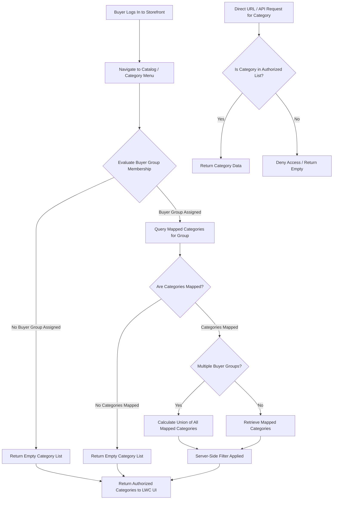

# Salesforce B2B Commerce Dynamic Category Visibility

**ID:** PRJ-B2B-CAT-VIS
**Version:** 1.0
**Status:** Draft
**Type:** Functional Specification

## Overview & Purpose
The organization needs to dynamically restrict product category visibility in their existing Salesforce B2B Commerce store based on the logged-in user's Buyer Group. Currently, B2B buyers lack dynamic, data-driven category filtering that aligns with their specific purchasing agreements. This Proof of Concept (POC) implements server-side category visibility enforcement to ensure buyers only see authorized categories without relying on insecure client-side hiding. The solution reuses the existing Salesforce org, B2B Commerce store, and data structures to align with Salesforce best practices and avoid unnecessary duplication.

## Goals
*   **OBJ-01:** Dynamically restrict product category visibility based on the logged-in user's Buyer Group. (Measure: 100% of unauthorized categories are filtered out server-side before reaching the storefront UI).
*   **OBJ-02:** Validate the end-to-end buyer login and visibility flow in the existing org. (Measure: Successful execution of a test flow from Buyer Account creation to verified category visibility in the storefront).

## Target Users
*   **B2B Buyer:** End-users who log into the storefront to browse and purchase products. They need a seamless browsing experience where they only see relevant and authorized product categories.
*   **Store Administrator:** Internal users responsible for configuring category access for different Buyer Groups without modifying code or hardcoding IDs.

## Stakeholders
*   **B2B Buyer:** (Decision authority: None) Concerns: Viewing only relevant and authorized product categories; seamless login and browsing experience.
*   **Store Administrator:** (Decision authority: Defines which categories are assigned to which Buyer Groups) Concerns: Configuring category access for different Buyer Groups; avoiding hardcoded IDs or names in the configuration.

## Scope
**In Scope:**
*   Server-side evaluation of logged-in user's Buyer Group membership.
*   Server-side filtering of returned product categories based on Buyer Group assignments.
*   Data-driven mechanism (e.g., junction object or standard sharing) to map Buyer Groups to Product Categories.
*   Creation of a test Buyer Account, Contact, and Experience Cloud user to validate the flow.

**Out of Scope:**
*   Product-level visibility restrictions beyond what is inherited from the category.
*   Creating a new Salesforce Org, B2B Commerce store, or WebStore.
*   Creating duplicate Buyer Groups, Categories, or Products if suitable ones already exist.
*   Modifying unrelated B2B Commerce implementations or features outside of category visibility.

## MoSCoW
None specified.

## Functional Requirements
*   **FR-01:** The system shall evaluate the logged-in user's Buyer Group membership upon accessing the storefront catalog.
*   **FR-02:** The system shall filter the returned product categories server-side based on the user's Buyer Group assignments.
*   **FR-03:** The system shall provide a data-driven mechanism to map Buyer Groups to specific Product Categories without hardcoding.
*   **FR-04:** The system shall support the creation of a test Buyer Account, Contact, and Experience Cloud user to validate the visibility flow.
*   **BR-01:** A buyer user inherits category visibility strictly from their assigned Buyer Group(s).
*   **BR-02:** Category visibility enforcement must occur before data is rendered by the LWC UI.

## User Stories
*   **US-01:** As a B2B Buyer, I want to view only the product categories assigned to my Buyer Group, so that I am not distracted by or able to access unauthorized products.
    *   *Acceptance Criteria 1:* GIVEN I am logged into the B2B Commerce storefront as a buyer user WHEN I navigate to the product catalog or category menu THEN I only see the categories that are explicitly mapped to my assigned Buyer Group.
    *   *Acceptance Criteria 2:* GIVEN I am a buyer user assigned to a Buyer Group with specific category access WHEN I attempt to access an unauthorized category via direct URL or API THEN the system denies access and does not return the category data.
*   **US-02:** As a Store Administrator, I want to configure category access for specific Buyer Groups, so that I can dynamically control what different buyers see without modifying code or hardcoding values.
    *   *Acceptance Criteria 1:* GIVEN I am a Store Administrator in Salesforce WHEN I map a Product Category to a Buyer Group using the designated data model THEN the system dynamically updates visibility rules for users in that Buyer Group.

## Inputs/Outputs/Data Flow
*   **Inputs:**
    *   Logged-in User Context (User ID).
    *   Buyer Group configuration data.
    *   Category mapping configuration data.
    *   Direct URL or API requests for category data.
*   **Data Flow:**
    1.  User authenticates into the B2B Commerce storefront.
    2.  System identifies the User's associated Account and Buyer Group(s).
    3.  System queries the data-driven mapping mechanism to retrieve authorized Product Categories for the identified Buyer Group(s).
    4.  System filters the master category list against the authorized list server-side.
    5.  System returns the filtered payload to the client.
*   **Outputs:**
    *   Filtered JSON payload of authorized Product Categories sent to the LWC UI.
    *   Empty list or access denied response for unauthorized requests.

## Flows

## Edge Cases & Error States
*   **EC-01:** The logged-in buyer user is not assigned to any Buyer Group.
    *   *Handling:* The system returns an empty category list, preventing access to any restricted catalog items.
*   **EC-02:** The buyer's assigned Buyer Group has no mapped categories.
    *   *Handling:* The system returns an empty category list for that user.
*   **EC-03:** A buyer user belongs to multiple Buyer Groups with different category mappings.
    *   *Handling:* The system grants access to the union (combination) of all categories mapped to the user's Buyer Groups.

## Acceptance Criteria
*   **AC-01 (Happy Path - Single Group):** GIVEN I am logged into the B2B Commerce storefront as a buyer user assigned to a single Buyer Group WHEN I navigate to the product catalog or category menu THEN I only see the categories explicitly mapped to my assigned Buyer Group.
*   **AC-02 (Security - Direct Access):** GIVEN I am a buyer user assigned to a Buyer Group with specific category access WHEN I attempt to access an unauthorized category via direct URL or API THEN the system denies access and does not return the category data.
*   **AC-03 (Admin Configuration):** GIVEN I am a Store Administrator in Salesforce WHEN I map a Product Category to a Buyer Group using the designated data model THEN the system dynamically updates visibility rules for users in that Buyer Group without requiring code deployment.
*   **AC-04 (Edge Case - No Group):** GIVEN I am a logged-in buyer user WHEN I am not assigned to any Buyer Group THEN the system returns an empty category list.
*   **AC-05 (Edge Case - No Categories):** GIVEN I am a logged-in buyer user assigned to a Buyer Group WHEN that Buyer Group has no mapped categories THEN the system returns an empty category list.
*   **AC-06 (Edge Case - Multiple Groups):** GIVEN I am a logged-in buyer user assigned to multiple Buyer Groups WHEN I navigate to the product catalog THEN the system grants access to the union of all categories mapped across all my assigned Buyer Groups.

## Non-Functional Requirements
*   **NFR-01 (Security):** Category filtering must be enforced server-side to prevent data leakage. (Target: 0 unauthorized categories returned in Apex or API responses to the client).
*   **NFR-02 (Performance):** Dynamic category filtering logic must not significantly degrade catalog load times. (Target: Server-side evaluation adds no more than 200ms to the category retrieval transaction).
*   **NFR-03 (Maintainability):** The solution must not use hardcoded IDs, names, or store references. (Target: 100% of category and buyer group references are resolved dynamically via SOQL or standard Salesforce context).

## Assumptions
*   **AD-02:** The existing customer/community user profile has the necessary baseline permissions to log into the B2B Commerce storefront. (Impact if wrong: The test buyer user will fail to log in, blocking the end-to-end validation flow).

## Dependencies
*   **AD-01:** An existing Salesforce org with a configured B2B Commerce store and catalog is available for the POC. (Impact if wrong: The POC cannot be implemented or tested without an underlying store infrastructure).

## Open Questions
*   **OQ-01:** What specific data model should be used to map Buyer Groups to Product Categories (e.g., custom junction object, standard sharing rules)? *(Recommended default from requirements: Create a custom junction object, e.g., `BuyerGroupCategory__c`, if standard sharing does not natively support this).*
*   **OQ-02:** Should parent categories automatically grant visibility to their child categories? *(Recommended default from requirements: Yes, to reduce configuration overhead).*
*   **OQ-03:** What is the MoSCoW prioritization for the functional requirements and user stories? (None specified in the provided documentation).

## Success Metrics
*   **SM-01 (Leading):** Successful end-to-end test flow execution. Target: 100% pass rate for the Buyer Account -> Contact -> Login -> Category Visibility validation. (Data required: Manual or automated test execution logs).
*   **SM-02 (Lagging):** Server-side enforcement compliance. Target: 0 instances of unauthorized categories exposed in network payloads. (Data required: Network traffic inspection during storefront browsing).